# Sophikon V1 - API Specification

**Version:** 1.0
**Date:** 2026-02-06
**Status:** Aligned with Database Schema v1.0
**Base URL:** `https://api.sophikon.app/api/v1`

---

## Document References

| Document                | Path                                                                        | Description              |
| ----------------------- | --------------------------------------------------------------------------- | ------------------------ |
| Database Schema         | [database-schema.md](./database-schema.md)                                  | 25 tables, full SQL      |
| Functional Requirements | [functional-requirements.md](../01-requirements/functional-requirements.md) | Requirements with FR IDs |
| User Stories            | [user-stories.md](../01-requirements/user-stories.md)                       | Acceptance criteria      |

---

## Overview

RESTful API built with FastAPI. All endpoints return JSON.

### Authentication

All endpoints except `/auth/*` require Bearer token:

```
Authorization: Bearer <access_token>
```

### Response Format

**Success:**

```json
{
  "data": { ... },
  "meta": {
    "timestamp": "2026-02-06T10:30:00Z"
  }
}
```

**Error:**

```json
{
  "error": {
    "code": "VALIDATION_ERROR",
    "message": "Invalid input",
    "details": [{ "field": "email", "message": "Invalid email format" }]
  }
}
```

### HTTP Status Codes

| Code | Meaning              |
| ---- | -------------------- |
| 200  | Success              |
| 201  | Created              |
| 204  | No Content (deleted) |
| 400  | Bad Request          |
| 401  | Unauthorized         |
| 403  | Forbidden            |
| 404  | Not Found            |
| 409  | Conflict             |
| 422  | Validation Error     |
| 429  | Rate Limited         |
| 500  | Server Error         |

---

## API Endpoints Map

```mermaid
flowchart TB
    subgraph Auth["/auth"]
        A1[POST /register]
        A2[POST /login]
        A3[POST /logout]
        A4[POST /refresh]
        A5[POST /password-reset]
        A6[GET /oauth/google]
    end

    subgraph Users["/users"]
        U1[GET /me]
        U2[PATCH /me]
        U3[GET /me/sessions]
        U4[GET /me/time-entries]
    end

    subgraph Projects["/projects"]
        P1[GET /]
        P2[POST /]
        P3[GET /:id]
        P4[PATCH /:id]
        P5[DELETE /:id]
        P6[GET /:id/dashboard]
    end

    subgraph Tasks["/projects/:id/tasks"]
        T1[GET /]
        T2[POST /]
        T3[GET /:taskId]
        T4[PATCH /:taskId]
        T5[DELETE /:taskId]
        T6[POST /bulk]
        T7[PATCH /reorder]
    end

    subgraph Resources["/projects/:id/resources"]
        R1[GET /]
        R2[POST /]
        R3[GET /:resourceId]
        R4[PATCH /:resourceId]
        R5[DELETE /:resourceId]
        R6[GET /:resourceId/workload]
    end

    subgraph Assignments["/tasks/:taskId/assignments"]
        AS1[GET /]
        AS2[POST /]
        AS3[PATCH /:assignmentId]
        AS4[DELETE /:assignmentId]
    end

    subgraph Calendars["/projects/:id/calendars"]
        C1[GET /]
        C2[POST /]
        C3[PATCH /:calendarId]
        C4[DELETE /:calendarId]
        C5[POST /:calendarId/exceptions]
    end

    subgraph Baselines["/projects/:id/baselines"]
        B1[GET /]
        B2[POST /]
        B3[GET /:baselineNum]
        B4[DELETE /:baselineNum]
    end

    subgraph TimeEntries["/time-entries"]
        TE1[POST /]
        TE2[GET /:id]
        TE3[PATCH /:id]
        TE4[DELETE /:id]
    end

    subgraph Comments["/comments"]
        CO1[GET /entity/:type/:id]
        CO2[POST /]
        CO3[PATCH /:id]
        CO4[DELETE /:id]
    end

    subgraph Notifications["/notifications"]
        N1[GET /]
        N2[PATCH /:id/read]
        N3[POST /read-all]
    end

    subgraph AI["/projects/:id/ai"]
        AI1[POST /chat]
        AI2[POST /estimate]
        AI3[GET /suggestions]
    end
```



---

## Endpoint Summary (75+ endpoints)

| Category      | Count | Endpoints                     |
| ------------- | ----- | ----------------------------- |
| Auth          | 8     | /auth/\*                      |
| Users         | 5     | /users/\*                     |
| Projects      | 8     | /projects/\*                  |
| Tasks         | 12    | /projects/:id/tasks/\*        |
| Dependencies  | 4     | /projects/:id/dependencies/\* |
| Schedule      | 2     | /projects/:id/schedule/\*     |
| Members       | 5     | /projects/:id/members/\*      |
| Calendars     | 7     | /projects/:id/calendars/\*    |
| Resources     | 9     | /projects/:id/resources/\*    |
| Assignments   | 5     | /tasks/:taskId/assignments/\* |
| Baselines     | 5     | /projects/:id/baselines/\*    |
| Time Entries  | 6     | /time-entries/\*              |
| Comments      | 5     | /comments/\*                  |
| Attachments   | 4     | /attachments/\*               |
| Notifications | 4     | /notifications/\*             |
| Activity      | 1     | /projects/:id/activity        |
| AI            | 3     | /projects/:id/ai/\*           |
| Export/Import | 4     | /projects/:id/export/\*       |
| WebSocket     | 1     | /ws/projects/:id              |

---

## 1. Authentication Endpoints

### POST /auth/register

Register a new user account.

**Request:**

```json
{
  "email": "user@example.com",
  "password": "securePassword123!",
  "full_name": "John Doe"
}
```

**Response:** `201 Created`

```json
{
  "data": {
    "user": {
      "id": "uuid",
      "email": "user@example.com",
      "full_name": "John Doe",
      "avatar_url": null,
      "system_role": "user",
      "created_at": "2026-02-06T10:30:00Z"
    },
    "access_token": "eyJ...",
    "refresh_token": "eyJ...",
    "token_type": "bearer",
    "expires_in": 3600
  }
}
```

**Errors:** `409` - Email already registered

---

### POST /auth/login

Login with email and password.

**Request:**

```json
{
  "email": "user@example.com",
  "password": "securePassword123!"
}
```

**Response:** `200 OK`

```json
{
  "data": {
    "user": { ... },
    "access_token": "eyJ...",
    "refresh_token": "eyJ...",
    "token_type": "bearer",
    "expires_in": 3600
  }
}
```

**Errors:** `401` - Invalid credentials, `403` - Account disabled

---

### POST /auth/logout

Revoke refresh token.

**Request:**

```json
{
  "refresh_token": "eyJ..."
}
```

**Response:** `204 No Content`

---

### POST /auth/refresh

Get new access token.

**Request:**

```json
{
  "refresh_token": "eyJ..."
}
```

**Response:** `200 OK`

```json
{
  "data": {
    "access_token": "eyJ...",
    "token_type": "bearer",
    "expires_in": 3600
  }
}
```

---

### POST /auth/password-reset

Request password reset email.

**Request:**

```json
{
  "email": "user@example.com"
}
```

**Response:** `200 OK`

---

### POST /auth/password-reset/confirm

Reset password with token.

**Request:**

```json
{
  "token": "reset-token-from-email",
  "new_password": "newSecurePassword123!"
}
```

**Response:** `200 OK`

---

### GET /auth/oauth/google

Redirect to Google OAuth consent screen.

**Response:** `302 Redirect`

---

### GET /auth/oauth/google/callback

Handle Google OAuth callback.

**Query Parameters:** `code`, `state`

**Response:** `302 Redirect` to frontend with tokens

---

## 2. User Endpoints

### GET /users/me

Get current user profile.

**Response:** `200 OK`

```json
{
  "data": {
    "id": "uuid",
    "email": "user@example.com",
    "full_name": "John Doe",
    "avatar_url": "https://...",
    "system_role": {
      "id": "uuid",
      "name": "user",
      "permissions": ["project:create", "project:read_own"]
    },
    "oauth_provider": null,
    "email_verified": true,
    "timezone": "America/New_York",
    "locale": "en-US",
    "preferences": { ... },
    "last_login_at": "2026-02-06T10:00:00Z",
    "created_at": "2026-02-01T10:30:00Z",
    "updated_at": "2026-02-06T10:30:00Z"
  }
}
```

---

### PATCH /users/me

Update profile.

**Request:**

```json
{
  "full_name": "John Smith",
  "avatar_url": "https://...",
  "timezone": "Europe/London",
  "preferences": {
    "email_notifications": true,
    "theme": "dark"
  }
}
```

**Response:** `200 OK`

---

### DELETE /users/me

Deactivate account.

**Response:** `204 No Content`

---

### GET /users/me/sessions

List active sessions.

**Response:** `200 OK`

```json
{
  "data": [
    {
      "id": "uuid",
      "device_info": "Chrome on Windows",
      "ip_address": "192.168.1.1",
      "created_at": "2026-02-06T10:00:00Z",
      "is_current": true
    }
  ]
}
```

---

### DELETE /users/me/sessions/:id

Revoke session.

**Response:** `204 No Content`

---

## 3. Project Endpoints

### GET /projects

List user's projects.

**Query Parameters:**

| Param    | Type   | Default     | Description              |
| -------- | ------ | ----------- | ------------------------ |
| status   | string | all         | Filter by status         |
| search   | string | -           | Search in name           |
| sort     | string | -updated_at | Sort field               |
| page     | int    | 1           | Page number              |
| per_page | int    | 20          | Items per page (max 100) |

**Response:** `200 OK`

```json
{
  "data": [
    {
      "id": "uuid",
      "name": "Website Redesign",
      "description": "Redesign company website",
      "status": "ACTIVE",
      "start_date": "2026-02-01",
      "finish_date": "2026-04-15",
      "percent_complete": 35.5,
      "task_count": 45,
      "resource_count": 8,
      "my_role": "owner",
      "created_at": "2026-02-01T10:00:00Z",
      "updated_at": "2026-02-06T14:30:00Z"
    }
  ],
  "meta": {
    "page": 1,
    "per_page": 20,
    "total": 5,
    "total_pages": 1
  }
}
```

---

### POST /projects

Create a new project.

**Request:**

```json
{
  "name": "Website Redesign",
  "description": "Redesign company website",
  "start_date": "2026-02-01",
  "schedule_from": "START",
  "currency": "USD",
  "settings": {
    "hours_per_day": 8,
    "default_task_type": "FIXED_UNITS"
  }
}
```

**Response:** `201 Created`

---

### GET /projects/:id

Get project details.

**Response:** `200 OK`

```json
{
  "data": {
    "id": "uuid",
    "name": "Website Redesign",
    "description": "...",
    "status": "ACTIVE",
    "start_date": "2026-02-01",
    "finish_date": "2026-04-15",
    "status_date": "2026-02-06",
    "schedule_from": "START",
    "default_calendar": {
      "id": "uuid",
      "name": "Standard"
    },
    "budget": 50000.00,
    "currency": "USD",
    "settings": { ... },
    "owner": {
      "id": "uuid",
      "full_name": "John Doe",
      "avatar_url": null
    },
    "my_role": "owner",
    "member_count": 5,
    "task_count": 45,
    "resource_count": 8,
    "percent_complete": 35.5,
    "created_at": "2026-02-01T10:00:00Z",
    "updated_at": "2026-02-06T14:30:00Z"
  }
}
```

---

### PATCH /projects/:id

Update project.

**Request:**

```json
{
  "name": "Website Redesign v2",
  "status": "ACTIVE",
  "status_date": "2026-02-06",
  "default_calendar_id": "uuid"
}
```

**Response:** `200 OK`

**Permissions:** owner, manager

---

### DELETE /projects/:id

Delete project (soft delete).

**Response:** `204 No Content`

**Permissions:** owner only

---

### GET /projects/:id/dashboard

Get project dashboard summary.

**Response:** `200 OK`

```json
{
  "data": {
    "summary": {
      "total_tasks": 45,
      "completed_tasks": 16,
      "in_progress_tasks": 12,
      "not_started_tasks": 17,
      "overdue_tasks": 3,
      "milestones": 5,
      "milestones_completed": 2,
      "percent_complete": 35.5
    },
    "schedule": {
      "start_date": "2026-02-01",
      "finish_date": "2026-04-15",
      "baseline_finish_date": "2026-04-10",
      "duration_days": 74,
      "days_elapsed": 5,
      "days_remaining": 69,
      "variance_days": 5
    },
    "resources": {
      "total_resources": 8,
      "overallocated_count": 2
    },
    "cost": {
      "budget": 50000.00,
      "total_cost": 48500.00,
      "actual_cost": 17000.00,
      "remaining_cost": 31500.00
    },
    "earned_value": {
      "bcws": 18000.00,
      "bcwp": 17000.00,
      "acwp": 17000.00,
      "spi": 0.94,
      "cpi": 1.0
    },
    "critical_path": {
      "task_count": 12,
      "total_duration_days": 74
    },
    "upcoming_milestones": [...],
    "overdue_tasks": [...],
    "recent_activity": [...]
  }
}
```

---

### POST /projects/:id/duplicate

Duplicate project.

**Request:**

```json
{
  "name": "Website Redesign - Copy",
  "include_progress": false,
  "include_resources": true,
  "include_assignments": true
}
```

**Response:** `201 Created`

---

## 4. Task Endpoints

### GET /projects/:id/tasks

Get all tasks.

**Query Parameters:**

| Param           | Type | Default | Description          |
| --------------- | ---- | ------- | -------------------- |
| include_deleted | bool | false   | Include soft-deleted |
| flat            | bool | false   | Flat list vs tree    |

**Response:** `200 OK`

```json
{
  "data": [
    {
      "id": "uuid",
      "parent_task_id": null,
      "wbs_code": "1",
      "outline_level": 1,
      "name": "Planning Phase",
      "start_date": "2026-02-01",
      "finish_date": "2026-02-14",
      "duration": 80640,
      "work": 0,
      "percent_complete": 100,
      "percent_work_complete": 100,
      "priority": 500,
      "is_milestone": false,
      "is_summary": true,
      "is_critical": true,
      "task_type": "FIXED_DURATION",
      "constraint_type": "ASAP",
      "total_slack": 0,
      "total_cost": 5000.00,
      "assignments": [
        {
          "id": "uuid",
          "resource_id": "uuid",
          "resource_name": "John Doe",
          "units": 1.0
        }
      ],
      "children": [...],
      "created_at": "2026-02-01T10:00:00Z",
      "updated_at": "2026-02-06T14:30:00Z"
    }
  ],
  "meta": {
    "total": 45,
    "summary_count": 8,
    "milestone_count": 5
  }
}
```

---

### POST /projects/:id/tasks

Create a task.

**Request:**

```json
{
  "name": "Design homepage",
  "parent_task_id": "uuid-or-null",
  "insert_after_id": "uuid-or-null",
  "duration": 2880,
  "start_date": "2026-02-10",
  "is_milestone": false,
  "task_type": "FIXED_UNITS",
  "effort_driven": true,
  "constraint_type": "ASAP",
  "notes": "Include responsive design"
}
```

**Response:** `201 Created`

---

### GET /projects/:id/tasks/:taskId

Get task details.

**Response:** `200 OK`

```json
{
  "data": {
    "id": "uuid",
    "wbs_code": "2.3",
    "name": "Design homepage",
    "notes": "Include responsive design",
    "start_date": "2026-02-10",
    "finish_date": "2026-02-12",
    "actual_start": null,
    "actual_finish": null,
    "duration": 2880,
    "work": 2880,
    "actual_duration": 0,
    "actual_work": 0,
    "remaining_duration": 2880,
    "remaining_work": 2880,
    "percent_complete": 50,
    "percent_work_complete": 50,
    "task_type": "FIXED_UNITS",
    "effort_driven": true,
    "constraint_type": "ASAP",
    "deadline": "2026-02-15",
    "total_slack": 0,
    "free_slack": 0,
    "is_critical": true,
    "fixed_cost": 0,
    "total_cost": 1200.00,
    "actual_cost": 600.00,
    "bcws": 1200.00,
    "bcwp": 600.00,
    "acwp": 600.00,
    "calendar": null,
    "assignments": [...],
    "predecessors": [
      {
        "dependency_id": "uuid",
        "task_id": "uuid",
        "task_name": "Wireframes",
        "wbs_code": "2.2",
        "type": "FS",
        "lag": 0
      }
    ],
    "successors": [...],
    "parent": {
      "id": "uuid",
      "name": "Design Phase"
    },
    "baselines": [
      {
        "baseline_number": 0,
        "start_date": "2026-02-10",
        "finish_date": "2026-02-11",
        "duration": 1440,
        "work": 1440,
        "cost": 600.00
      }
    ],
    "comments_count": 3,
    "attachments_count": 2,
    "created_at": "2026-02-01T10:00:00Z",
    "updated_at": "2026-02-06T14:30:00Z"
  }
}
```

---

### PATCH /projects/:id/tasks/:taskId

Update task.

**Request:**

```json
{
  "name": "Design homepage - Updated",
  "percent_complete": 75,
  "actual_start": "2026-02-10",
  "duration": 4320
}
```

**Response:** `200 OK`

---

### DELETE /projects/:id/tasks/:taskId

Delete task (soft delete).

**Query Parameters:**

| Param           | Type | Default | Description               |
| --------------- | ---- | ------- | ------------------------- |
| delete_children | bool | true    | Delete children or orphan |

**Response:** `204 No Content`

---

### POST /projects/:id/tasks/bulk

Bulk create tasks.

**Request:**

```json
{
  "tasks": [
    {
      "name": "Task 1",
      "duration": 480,
      "parent_task_id": null
    },
    {
      "name": "Task 2",
      "duration": 960,
      "parent_task_id": null
    }
  ]
}
```

**Response:** `201 Created`

---

### PATCH /projects/:id/tasks/reorder

Reorder tasks.

**Request:**

```json
{
  "task_id": "uuid",
  "new_parent_id": "uuid-or-null",
  "new_index": 2
}
```

**Response:** `200 OK`

---

### POST /projects/:id/tasks/:taskId/indent

Indent task.

**Response:** `200 OK`

---

### POST /projects/:id/tasks/:taskId/outdent

Outdent task.

**Response:** `200 OK`

---

## 5. Dependency Endpoints

### GET /projects/:id/dependencies

Get all dependencies.

**Response:** `200 OK`

```json
{
  "data": [
    {
      "id": "uuid",
      "predecessor_id": "uuid",
      "predecessor_name": "Design homepage",
      "predecessor_wbs": "2.3",
      "successor_id": "uuid",
      "successor_name": "Develop homepage",
      "successor_wbs": "3.1",
      "type": "FS",
      "lag": 0,
      "lag_format": "DURATION",
      "is_disabled": false,
      "created_at": "2026-02-01T10:00:00Z"
    }
  ]
}
```

---

### POST /projects/:id/dependencies

Create dependency.

**Request:**

```json
{
  "predecessor_id": "uuid",
  "successor_id": "uuid",
  "type": "FS",
  "lag": 0,
  "lag_format": "DURATION"
}
```

**Response:** `201 Created`

**Errors:** `400` - Circular dependency, `409` - Already exists

---

### PATCH /projects/:id/dependencies/:depId

Update dependency.

**Request:**

```json
{
  "type": "FF",
  "lag": 480,
  "is_disabled": false
}
```

**Response:** `200 OK`

---

### DELETE /projects/:id/dependencies/:depId

Delete dependency.

**Response:** `204 No Content`

---

## 6. Schedule Endpoints

### POST /projects/:id/schedule/calculate

Recalculate schedule.

**Response:** `200 OK`

```json
{
  "data": {
    "tasks_updated": 45,
    "project_finish_date": "2026-04-15",
    "critical_path_length": 12,
    "calculation_time_ms": 150
  }
}
```

---

### GET /projects/:id/schedule/critical-path

Get critical path.

**Response:** `200 OK`

```json
{
  "data": {
    "tasks": [
      {
        "id": "uuid",
        "wbs_code": "1.1",
        "name": "Requirements",
        "start_date": "2026-02-01",
        "finish_date": "2026-02-05",
        "duration": 2880
      }
    ],
    "total_duration": 106560,
    "project_start": "2026-02-01",
    "project_finish": "2026-04-15"
  }
}
```

---

## 7. Calendar Endpoints

### GET /projects/:id/calendars

List calendars.

**Response:** `200 OK`

```json
{
  "data": [
    {
      "id": "uuid",
      "name": "Standard",
      "is_base": true,
      "base_calendar_id": null,
      "work_week": [...],
      "exception_count": 5,
      "created_at": "2026-02-01T10:00:00Z"
    }
  ]
}
```

---

### POST /projects/:id/calendars

Create calendar.

**Request:**

```json
{
  "name": "Night Shift",
  "base_calendar_id": "uuid",
  "work_week": [
    null,
    { "start": "22:00", "end": "06:00", "breaks": [] },
    { "start": "22:00", "end": "06:00", "breaks": [] },
    { "start": "22:00", "end": "06:00", "breaks": [] },
    { "start": "22:00", "end": "06:00", "breaks": [] },
    { "start": "22:00", "end": "06:00", "breaks": [] },
    null
  ]
}
```

**Response:** `201 Created`

---

### GET /projects/:id/calendars/:calendarId

Get calendar details.

**Response:** `200 OK`

```json
{
  "data": {
    "id": "uuid",
    "name": "Standard",
    "is_base": true,
    "base_calendar": null,
    "work_week": [...],
    "exceptions": [
      {
        "id": "uuid",
        "name": "Christmas",
        "start_date": "2026-12-25",
        "end_date": "2026-12-25",
        "is_working": false,
        "work_times": null,
        "recurrence": {"type": "yearly", "month": 12, "day": 25}
      }
    ]
  }
}
```

---

### PATCH /projects/:id/calendars/:calendarId

Update calendar.

**Request:**

```json
{
  "name": "Standard (Updated)",
  "work_week": [...]
}
```

**Response:** `200 OK`

---

### DELETE /projects/:id/calendars/:calendarId

Delete calendar.

**Response:** `204 No Content`

**Note:** Cannot delete if in use by tasks/resources

---

### POST /projects/:id/calendars/:calendarId/exceptions

Add exception.

**Request:**

```json
{
  "name": "Company Holiday",
  "start_date": "2026-07-04",
  "end_date": "2026-07-04",
  "is_working": false,
  "recurrence": { "type": "yearly", "month": 7, "day": 4 }
}
```

**Response:** `201 Created`

---

### DELETE /projects/:id/calendars/:calendarId/exceptions/:exceptionId

Delete exception.

**Response:** `204 No Content`

---

## 8. Resource Endpoints

### GET /projects/:id/resources

List resources.

**Query Parameters:**

| Param            | Type   | Default | Description          |
| ---------------- | ------ | ------- | -------------------- |
| type             | string | all     | WORK, MATERIAL, COST |
| group            | string | -       | Filter by group      |
| include_inactive | bool   | false   | Include inactive     |

**Response:** `200 OK`

```json
{
  "data": [
    {
      "id": "uuid",
      "name": "John Doe",
      "initials": "JD",
      "email": "john@example.com",
      "type": "WORK",
      "max_units": 1.0,
      "group_name": "Developers",
      "is_generic": false,
      "is_active": true,
      "standard_rate": 75.0,
      "overtime_rate": 112.5,
      "cost_per_use": 0,
      "user": {
        "id": "uuid",
        "full_name": "John Doe",
        "avatar_url": null
      },
      "calendar": {
        "id": "uuid",
        "name": "Standard"
      },
      "assignment_count": 12,
      "created_at": "2026-02-01T10:00:00Z"
    }
  ]
}
```

---

### POST /projects/:id/resources

Create resource.

**Request:**

```json
{
  "name": "Jane Smith",
  "email": "jane@example.com",
  "type": "WORK",
  "max_units": 1.0,
  "group_name": "Developers",
  "standard_rate": 80.0,
  "overtime_rate": 120.0,
  "calendar_id": "uuid",
  "user_id": "uuid"
}
```

**Response:** `201 Created`

---

### GET /projects/:id/resources/:resourceId

Get resource details.

**Response:** `200 OK`

---

### PATCH /projects/:id/resources/:resourceId

Update resource.

**Response:** `200 OK`

---

### DELETE /projects/:id/resources/:resourceId

Delete resource.

**Response:** `204 No Content`

---

### GET /projects/:id/resources/:resourceId/workload

Get resource workload.

**Query Parameters:**

| Param      | Type   | Default       | Description      |
| ---------- | ------ | ------------- | ---------------- |
| start_date | date   | project start | Period start     |
| end_date   | date   | project end   | Period end       |
| time_unit  | string | day           | day, week, month |

**Response:** `200 OK`

```json
{
  "data": {
    "resource_id": "uuid",
    "resource_name": "John Doe",
    "max_units": 1.0,
    "periods": [
      {
        "start_date": "2026-02-10",
        "end_date": "2026-02-10",
        "allocated_work": 480,
        "available_work": 480,
        "allocation_percent": 100,
        "is_overallocated": false,
        "tasks": [
          {
            "task_id": "uuid",
            "task_name": "Design homepage",
            "work": 480,
            "units": 1.0
          }
        ]
      }
    ]
  }
}
```

---

### GET /projects/:id/resources/overallocated

Get overallocated resources.

**Response:** `200 OK`

```json
{
  "data": [
    {
      "resource_id": "uuid",
      "resource_name": "John Doe",
      "overallocated_periods": [
        {
          "date": "2026-02-15",
          "allocation_percent": 150,
          "tasks": [...]
        }
      ]
    }
  ]
}
```

---

### POST /projects/:id/resources/:resourceId/rates

Add rate entry.

**Request:**

```json
{
  "rate_table": "A",
  "effective_date": "2026-03-01",
  "standard_rate": 85.0,
  "overtime_rate": 127.5,
  "cost_per_use": 0
}
```

**Response:** `201 Created`

---

### POST /projects/:id/resources/:resourceId/availability

Add availability period.

**Request:**

```json
{
  "start_date": "2026-03-01",
  "end_date": "2026-06-30",
  "units": 0.5
}
```

**Response:** `201 Created`

---

## 9. Assignment Endpoints

### GET /tasks/:taskId/assignments

List task assignments.

**Response:** `200 OK`

```json
{
  "data": [
    {
      "id": "uuid",
      "task_id": "uuid",
      "resource": {
        "id": "uuid",
        "name": "John Doe",
        "type": "WORK"
      },
      "units": 1.0,
      "work": 2880,
      "actual_work": 1440,
      "remaining_work": 1440,
      "start_date": "2026-02-10",
      "finish_date": "2026-02-12",
      "percent_work_complete": 50,
      "work_contour": "FLAT",
      "cost": 600.0,
      "actual_cost": 300.0,
      "is_confirmed": false
    }
  ]
}
```

---

### POST /tasks/:taskId/assignments

Create assignment.

**Request:**

```json
{
  "resource_id": "uuid",
  "units": 1.0,
  "work": 2880,
  "work_contour": "FLAT"
}
```

**Response:** `201 Created`

---

### PATCH /assignments/:assignmentId

Update assignment.

**Request:**

```json
{
  "units": 0.5,
  "actual_work": 1440,
  "is_confirmed": true
}
```

**Response:** `200 OK`

---

### DELETE /assignments/:assignmentId

Delete assignment.

**Response:** `204 No Content`

---

### GET /resources/:resourceId/assignments

List resource assignments.

**Response:** `200 OK`

---

## 10. Baseline Endpoints

### GET /projects/:id/baselines

List baselines.

**Response:** `200 OK`

```json
{
  "data": [
    {
      "baseline_number": 0,
      "name": "Original Plan",
      "task_count": 45,
      "created_at": "2026-02-01T10:00:00Z"
    },
    {
      "baseline_number": 1,
      "name": "After scope change",
      "task_count": 52,
      "created_at": "2026-02-15T10:00:00Z"
    }
  ]
}
```

---

### POST /projects/:id/baselines

Save baseline.

**Request:**

```json
{
  "baseline_number": 1,
  "name": "After scope change"
}
```

**Response:** `201 Created`

---

### GET /projects/:id/baselines/:baselineNum

Get baseline details.

**Response:** `200 OK`

```json
{
  "data": {
    "baseline_number": 0,
    "name": "Original Plan",
    "created_at": "2026-02-01T10:00:00Z",
    "project_summary": {
      "start_date": "2026-02-01",
      "finish_date": "2026-04-10",
      "total_work": 500000,
      "total_cost": 48000.0
    },
    "tasks": [
      {
        "task_id": "uuid",
        "task_name": "Design homepage",
        "wbs_code": "2.3",
        "start_date": "2026-02-10",
        "finish_date": "2026-02-11",
        "duration": 1440,
        "work": 1440,
        "cost": 600.0
      }
    ]
  }
}
```

---

### GET /projects/:id/baselines/:baselineNum/compare

Compare baseline to current.

**Response:** `200 OK`

```json
{
  "data": {
    "summary": {
      "baseline_finish": "2026-04-10",
      "current_finish": "2026-04-15",
      "variance_days": 5,
      "baseline_cost": 48000.0,
      "current_cost": 50000.0,
      "cost_variance": 2000.0
    },
    "task_variances": [
      {
        "task_id": "uuid",
        "task_name": "Design homepage",
        "baseline_finish": "2026-02-11",
        "current_finish": "2026-02-12",
        "finish_variance_days": 1,
        "baseline_cost": 600.0,
        "current_cost": 1200.0,
        "cost_variance": 600.0
      }
    ]
  }
}
```

---

### DELETE /projects/:id/baselines/:baselineNum

Clear baseline.

**Response:** `204 No Content`

---

## 11. Time Entry Endpoints

### POST /time-entries

Log time.

**Request:**

```json
{
  "task_id": "uuid",
  "assignment_id": "uuid",
  "work_date": "2026-02-06",
  "regular_work": 480,
  "overtime_work": 0,
  "notes": "Completed homepage design",
  "is_billable": true
}
```

**Response:** `201 Created`

---

### GET /time-entries/:id

Get time entry.

**Response:** `200 OK`

```json
{
  "data": {
    "id": "uuid",
    "user": {
      "id": "uuid",
      "full_name": "John Doe"
    },
    "task": {
      "id": "uuid",
      "name": "Design homepage",
      "wbs_code": "2.3"
    },
    "assignment_id": "uuid",
    "work_date": "2026-02-06",
    "regular_work": 480,
    "overtime_work": 0,
    "notes": "Completed homepage design",
    "is_billable": true,
    "billing_status": "UNBILLED",
    "status": "SUBMITTED",
    "approved_by": null,
    "approved_at": null,
    "created_at": "2026-02-06T17:00:00Z"
  }
}
```

---

### PATCH /time-entries/:id

Update time entry.

**Response:** `200 OK`

**Note:** Cannot edit after approved

---

### DELETE /time-entries/:id

Delete time entry.

**Response:** `204 No Content`

**Note:** Cannot delete after approved

---

### GET /users/me/time-entries

My timesheet.

**Query Parameters:**

| Param      | Type | Default    | Description       |
| ---------- | ---- | ---------- | ----------------- |
| start_date | date | week start | Period start      |
| end_date   | date | week end   | Period end        |
| project_id | uuid | -          | Filter by project |

**Response:** `200 OK`

```json
{
  "data": {
    "entries": [...],
    "summary": {
      "total_regular": 2400,
      "total_overtime": 120,
      "by_project": [
        {
          "project_id": "uuid",
          "project_name": "Website Redesign",
          "regular_work": 1920,
          "overtime_work": 60
        }
      ]
    }
  }
}
```

---

### GET /projects/:id/time-entries

Project time entries.

**Response:** `200 OK`

---

### PATCH /time-entries/:id/approve

Approve time entry.

**Request:**

```json
{
  "action": "approve"
}
```

Or reject:

```json
{
  "action": "reject",
  "reason": "Hours seem excessive for this task"
}
```

**Response:** `200 OK`

**Permissions:** owner, manager

---

## 12. Comment Endpoints

### GET /comments/entity/:entityType/:entityId

Get comments for entity.

**Response:** `200 OK`

```json
{
  "data": [
    {
      "id": "uuid",
      "author": {
        "id": "uuid",
        "full_name": "John Doe",
        "avatar_url": null
      },
      "content": "Looking good! Just a few tweaks needed.",
      "mentions": ["uuid"],
      "parent_comment_id": null,
      "is_edited": false,
      "created_at": "2026-02-06T14:30:00Z",
      "replies": [
        {
          "id": "uuid",
          "author": {...},
          "content": "@John Done!",
          "parent_comment_id": "uuid",
          "created_at": "2026-02-06T15:00:00Z"
        }
      ]
    }
  ]
}
```

---

### POST /comments

Create comment.

**Request:**

```json
{
  "entity_type": "task",
  "entity_id": "uuid",
  "content": "Looking good! @Jane can you review?",
  "parent_comment_id": null
}
```

**Response:** `201 Created`

---

### PATCH /comments/:id

Edit comment.

**Request:**

```json
{
  "content": "Updated comment text"
}
```

**Response:** `200 OK`

---

### DELETE /comments/:id

Delete comment.

**Response:** `204 No Content`

---

## 13. Attachment Endpoints

### GET /attachments/entity/:entityType/:entityId

Get attachments for entity.

**Response:** `200 OK`

```json
{
  "data": [
    {
      "id": "uuid",
      "file_name": "wireframes.pdf",
      "file_size": 2456789,
      "mime_type": "application/pdf",
      "description": "Homepage wireframes",
      "uploaded_by": {
        "id": "uuid",
        "full_name": "John Doe"
      },
      "download_url": "https://...",
      "created_at": "2026-02-06T10:00:00Z"
    }
  ]
}
```

---

### POST /attachments

Upload attachment.

**Request:** `multipart/form-data`

| Field       | Type   | Description            |
| ----------- | ------ | ---------------------- |
| file        | file   | File to upload         |
| entity_type | string | task, project, comment |
| entity_id   | uuid   | Entity ID              |
| description | string | Optional description   |

**Response:** `201 Created`

---

### GET /attachments/:id/download

Download attachment.

**Response:** File stream

---

### DELETE /attachments/:id

Delete attachment.

**Response:** `204 No Content`

---

## 14. Notification Endpoints

### GET /notifications

Get notifications.

**Query Parameters:**

| Param       | Type | Default | Description |
| ----------- | ---- | ------- | ----------- |
| unread_only | bool | false   | Only unread |
| page        | int  | 1       | Page        |
| per_page    | int  | 20      | Per page    |

**Response:** `200 OK`

```json
{
  "data": [
    {
      "id": "uuid",
      "type": "task_assigned",
      "title": "You were assigned to a task",
      "message": "John assigned you to 'Design homepage'",
      "entity_type": "task",
      "entity_id": "uuid",
      "actor": {
        "id": "uuid",
        "full_name": "John Doe",
        "avatar_url": null
      },
      "is_read": false,
      "created_at": "2026-02-06T14:30:00Z"
    }
  ],
  "meta": {
    "unread_count": 5
  }
}
```

---

### PATCH /notifications/:id/read

Mark as read.

**Response:** `200 OK`

---

### POST /notifications/read-all

Mark all as read.

**Response:** `200 OK`

---

### GET /notifications/settings

Get notification settings.

**Response:** `200 OK`

```json
{
  "data": {
    "email_task_assigned": true,
    "email_mentioned": true,
    "email_deadline_approaching": true,
    "push_enabled": false
  }
}
```

---

## 15. Activity Log Endpoints

### GET /projects/:id/activity

Get activity log.

**Query Parameters:**

| Param       | Type   | Default | Description      |
| ----------- | ------ | ------- | ---------------- |
| page        | int    | 1       | Page             |
| per_page    | int    | 50      | Per page         |
| user_id     | uuid   | -       | Filter by user   |
| entity_type | string | -       | Filter by type   |
| action      | string | -       | Filter by action |

**Response:** `200 OK`

```json
{
  "data": [
    {
      "id": "uuid",
      "user": {
        "id": "uuid",
        "full_name": "John Doe",
        "avatar_url": null
      },
      "action": "updated",
      "entity_type": "task",
      "entity_id": "uuid",
      "entity_name": "Design homepage",
      "changes": {
        "fields": [{ "field": "percent_complete", "old": 50, "new": 75 }]
      },
      "created_at": "2026-02-06T14:30:00Z"
    }
  ]
}
```

---

## 16. AI Endpoints

### POST /projects/:id/ai/chat

Chat with AI (streaming).

**Request:**

```json
{
  "message": "What tasks are overdue?",
  "conversation_id": "uuid-or-null"
}
```

**Response:** `200 OK` (Server-Sent Events)

```
data: {"type": "start", "conversation_id": "uuid"}
data: {"type": "chunk", "content": "Based on"}
data: {"type": "chunk", "content": " the project data"}
data: {"type": "done", "message_id": "uuid", "usage": {"tokens_in": 1250, "tokens_out": 342}}
```

---

### POST /projects/:id/ai/estimate

Get AI estimates.

**Request:**

```json
{
  "task_ids": ["uuid1", "uuid2"],
  "include_reasoning": true
}
```

**Response:** `200 OK`

```json
{
  "data": {
    "estimates": [
      {
        "task_id": "uuid",
        "task_name": "Implement payment integration",
        "optimistic_days": 3,
        "likely_days": 5,
        "pessimistic_days": 8,
        "recommended_days": 5,
        "confidence": 0.75,
        "reasoning": "Payment integrations typically involve..."
      }
    ],
    "usage": {
      "tokens_in": 850,
      "tokens_out": 420
    }
  }
}
```

---

### GET /projects/:id/ai/suggestions

Get AI suggestions.

**Response:** `200 OK`

```json
{
  "data": {
    "suggestions": [
      {
        "id": "sugg-1",
        "type": "MISSING_DEPENDENCY",
        "severity": "MEDIUM",
        "title": "Possible missing dependency",
        "description": "Task 'Deploy' might depend on 'QA testing'",
        "affected_task_id": "uuid",
        "suggested_action": {
          "type": "ADD_DEPENDENCY",
          "predecessor_id": "uuid",
          "successor_id": "uuid"
        }
      }
    ]
  }
}
```

---

## 17. Export/Import Endpoints

### GET /projects/:id/export/csv

Export to CSV.

**Response:** `200 OK` (Content-Type: text/csv)

---

### GET /projects/:id/export/xml

Export to MS Project XML.

**Response:** `200 OK` (Content-Type: application/xml)

---

### POST /projects/:id/import

Import from file.

**Request:** `multipart/form-data`

| Field  | Type   | Description       |
| ------ | ------ | ----------------- |
| file   | file   | CSV or XML file   |
| format | string | csv or mspdi      |
| mode   | string | replace or append |

**Response:** `200 OK`

```json
{
  "data": {
    "tasks_imported": 45,
    "resources_imported": 8,
    "dependencies_imported": 32,
    "warnings": []
  }
}
```

---

### GET /projects/:id/export/png

Export Gantt as PNG.

**Query Parameters:**

| Param      | Type | Default       | Description |
| ---------- | ---- | ------------- | ----------- |
| width      | int  | 1920          | Image width |
| start_date | date | project start | View start  |
| end_date   | date | project end   | View end    |

**Response:** `200 OK` (Content-Type: image/png)

---

## 18. WebSocket API

### Connect

```
wss://api.projectlibre.app/ws/projects/:id?token=<access_token>
```

### Message Types

**Client → Server:**

```json
{
  "type": "subscribe",
  "channels": ["tasks", "resources", "members", "activity"]
}
```

```json
{
  "type": "presence",
  "status": "editing",
  "entity_type": "task",
  "entity_id": "uuid"
}
```

**Server → Client:**

```json
{"type": "task_updated", "data": {"task_id": "uuid", "changes": {...}, "updated_by": {...}}}
```

```json
{"type": "task_created", "data": {...}}
```

```json
{ "type": "task_deleted", "data": { "task_id": "uuid" } }
```

```json
{"type": "resource_updated", "data": {...}}
```

```json
{"type": "assignment_updated", "data": {...}}
```

```json
{"type": "presence_update", "data": {"users": [...]}}
```

---

## 19. Health & Meta

### GET /health

Health check.

**Response:** `200 OK`

```json
{
  "status": "healthy",
  "version": "2.0.0",
  "timestamp": "2026-02-06T10:30:00Z"
}
```

---

### GET /openapi.json

OpenAPI 3.0 specification.

---

## Rate Limits

| Endpoint Category | Limit                     |
| ----------------- | ------------------------- |
| Auth endpoints    | 10 req/min                |
| AI endpoints      | 30 req/min                |
| File uploads      | 10 req/min                |
| Other endpoints   | 100 req/min               |
| WebSocket         | 1 connection/project/user |

---

## FastAPI Features to Demonstrate

| Feature              | Endpoints Using It               |
| -------------------- | -------------------------------- |
| Async/await          | All endpoints                    |
| Dependency Injection | Auth, DB session, permissions    |
| Pydantic validation  | All request/response models      |
| OAuth2 + JWT         | /auth/\*                         |
| WebSocket            | /ws/projects/:id                 |
| Streaming Response   | /ai/chat                         |
| Background Tasks     | /schedule/calculate, /export/\*  |
| File Upload          | /import, /attachments            |
| Query parameters     | List endpoints with pagination   |
| Path parameters      | All resource endpoints           |
| Response models      | All endpoints                    |
| Error handling       | Custom exception handlers        |
| Middleware           | CORS, logging, rate limiting     |
| RBAC                 | Permission checks via dependency |

---

## Document History

| Version | Date       | Author    | Changes                                                                                                   |
| ------- | ---------- | --------- | --------------------------------------------------------------------------------------------------------- |
| 1.0     | 2026-02-05 | Ermir | Initial draft                                                                                             |
| 2.0     | 2026-02-05 | Ermir | Added WebSocket                                                                                           |
| 3.0     | 2026-02-06 | Ermir | Added resources, calendars, baselines, time entries, comments, attachments, notifications (75+ endpoints) |
