# Sophikon V1.0 - Database Schema

**Version:** 2.1  
**Date:** 2026-02-13  
**Status:** Added organization & organization_member tables for multi-tenancy

---

## Design Principles

1. **Based on original ProjectLibre** - Extracted from Java codebase analysis
2. **Industry standards** - Follows project management data patterns
3. **RBAC-ready** - Role table from day 1 for clean enterprise upgrade
4. **Extensible** - JSONB for flexible data, proper normalization
5. **Audit-friendly** - Soft deletes, timestamps, activity logging
6. **UUIDv7** - Time-ordered UUIDs for better index performance

## PostgreSQL Extensions Required

```sql
CREATE EXTENSION IF NOT EXISTS "uuid-ossp";      -- For UUID functions
CREATE EXTENSION IF NOT EXISTS "pg_uuidv7";      -- For UUIDv7 generation
```

---

## Schema Overview

### V1.0 MVP Tables (27 tables)

| Category          | Tables                                         |
| ----------------- | ---------------------------------------------- |
| **Auth & Users**  | user, role, refresh_token, password_reset      |
| **Organizations** | organization, organization_member              |
| **Project Core**  | project, project_member, project_invitation    |
| **Scheduling**    | calendar, calendar_exception                   |
| **Work Items**    | task, task_baseline                            |
| **Dependencies**  | dependency                                     |
| **Resources**     | resource, resource_rate, resource_availability |
| **Assignments**   | assignment, assignment_baseline                |
| **Time Tracking** | time_entry                                     |
| **Collaboration** | comment, attachment, notification              |
| **AI**            | ai_conversation, ai_message, ai_usage          |
| **Audit**         | activity_log                                   |

---

## Entity Relationship Diagram

```mermaid
erDiagram
    %% ==================== AUTH & RBAC ====================
    USER ||--o{ REFRESH_TOKEN : "has"
    USER ||--o{ PASSWORD_RESET : "requests"
    USER }o--|| ROLE : "has system role"

    %% ==================== ORGANIZATIONS ====================
    ORGANIZATION ||--o{ ORGANIZATION_MEMBER : "has members"
    USER ||--o{ ORGANIZATION_MEMBER : "belongs to"
    ORGANIZATION ||--o{ PROJECT : "contains"

    %% ==================== PROJECT CORE ====================
    USER ||--o{ PROJECT : "owns"
    PROJECT ||--o{ PROJECT_MEMBER : "has members"
    PROJECT_MEMBER }o--|| ROLE : "has project role"
    PROJECT ||--o{ PROJECT_INVITATION : "has invites"

    %% ==================== CALENDARS ====================
    PROJECT ||--o{ CALENDAR : "has calendars"
    PROJECT }o--o| CALENDAR : "default calendar"
    CALENDAR ||--o{ CALENDAR_EXCEPTION : "has exceptions"
    CALENDAR ||--o| CALENDAR : "inherits from base"

    %% ==================== TASKS ====================
    PROJECT ||--o{ TASK : "contains"
    TASK ||--o{ TASK : "parent of (WBS)"
    TASK }o--o| CALENDAR : "uses calendar"
    TASK ||--o{ TASK_BASELINE : "has baselines"

    %% ==================== DEPENDENCIES ====================
    TASK ||--o{ DEPENDENCY : "predecessor"
    TASK ||--o{ DEPENDENCY : "successor"

    %% ==================== RESOURCES ====================
    PROJECT ||--o{ RESOURCE : "has resources"
    RESOURCE }o--o| CALENDAR : "uses calendar"
    RESOURCE ||--o{ RESOURCE_RATE : "has cost rates"
    RESOURCE ||--o{ RESOURCE_AVAILABILITY : "availability periods"

    %% ==================== ASSIGNMENTS ====================
    TASK ||--o{ ASSIGNMENT : "has assignments"
    RESOURCE ||--o{ ASSIGNMENT : "assigned to"
    ASSIGNMENT ||--o{ ASSIGNMENT_BASELINE : "has baselines"

    %% ==================== TIME TRACKING ====================
    USER ||--o{ TIME_ENTRY : "logs time"
    TASK ||--o{ TIME_ENTRY : "time logged to"
    ASSIGNMENT ||--o{ TIME_ENTRY : "for assignment"

    %% ==================== COLLABORATION ====================
    USER ||--o{ COMMENT : "writes"
    TASK ||--o{ COMMENT : "has comments"
    USER ||--o{ ATTACHMENT : "uploads"
    TASK ||--o{ ATTACHMENT : "has attachments"
    PROJECT ||--o{ ATTACHMENT : "has attachments"
    USER ||--o{ NOTIFICATION : "receives"

    %% ==================== AI ====================
    USER ||--o{ AI_CONVERSATION : "chats"
    PROJECT ||--o{ AI_CONVERSATION : "context"
    AI_CONVERSATION ||--o{ AI_MESSAGE : "contains"
    USER ||--o{ AI_USAGE : "consumes"

    %% ==================== AUDIT ====================
    USER ||--o{ ACTIVITY_LOG : "performs"
    PROJECT ||--o{ ACTIVITY_LOG : "tracks"
```



---

## Table Definitions

> **Note:** All tables use UUIDv7 for primary keys (`uuid_generate_v7()`) for better index performance and time-ordering.

### 1. AUTH & RBAC

#### USER

Core user account table for authentication and profile management.

| Column             | Type         | Constraints       | Default            | Description                          |
| ------------------ | ------------ | ----------------- | ------------------ | ------------------------------------ |
| **id**             | UUID         | PK                | uuid_generate_v7() | Primary key                          |
| **email**          | VARCHAR(255) | NOT NULL, UNIQUE  | -                  | Login identifier                     |
| **password_hash**  | VARCHAR(255) | NULL              | -                  | bcrypt hash (NULL for OAuth users)   |
| **full_name**      | VARCHAR(255) | NOT NULL          | -                  | Display name                         |
| **avatar_url**     | VARCHAR(500) | NULL              | -                  | Profile picture URL                  |
| **system_role_id** | UUID         | NOT NULL, FK→role | -                  | System-level role (admin/user)       |
| **oauth_provider** | VARCHAR(50)  | NULL              | -                  | OAuth provider (google, github)      |
| **oauth_id**       | VARCHAR(255) | NULL              | -                  | Provider's user ID                   |
| **is_active**      | BOOLEAN      | NOT NULL          | TRUE               | Account enabled/disabled             |
| **email_verified** | BOOLEAN      | NOT NULL          | FALSE              | Email confirmation status            |
| **preferences**    | JSONB        | NOT NULL          | {}                 | User settings (theme, notifications) |
| **timezone**       | VARCHAR(50)  | NOT NULL          | 'UTC'              | User timezone                        |
| **locale**         | VARCHAR(10)  | NOT NULL          | 'en-US'            | Language/region                      |
| **last_login_at**  | TIMESTAMPTZ  | NULL              | -                  | Last login timestamp                 |
| **created_at**     | TIMESTAMPTZ  | NOT NULL          | NOW()              | Registration timestamp               |
| **updated_at**     | TIMESTAMPTZ  | NOT NULL          | NOW()              | Last update timestamp                |

**Indexes:**

- `idx_user_oauth` - UNIQUE(oauth_provider, oauth_id) WHERE oauth_provider IS NOT NULL

---

#### ROLE

Role-based access control for both system-level and project-level permissions.

| Column          | Type         | Constraints      | Default            | Description                             |
| --------------- | ------------ | ---------------- | ------------------ | --------------------------------------- |
| **id**          | UUID         | PK               | uuid_generate_v7() | Primary key                             |
| **name**        | VARCHAR(100) | NOT NULL, UNIQUE | -                  | Role name (admin, user, owner, etc.)    |
| **description** | TEXT         | NULL             | -                  | Role description                        |
| **permissions** | JSONB        | NOT NULL         | []                 | Permission array (e.g., ["project:*"])  |
| **is_system**   | BOOLEAN      | NOT NULL         | FALSE              | System roles cannot be modified/deleted |
| **scope**       | VARCHAR(20)  | NOT NULL         | 'project'          | 'system' or 'project'                   |
| **created_at**  | TIMESTAMPTZ  | NOT NULL         | NOW()              | Creation timestamp                      |
| **updated_at**  | TIMESTAMPTZ  | NOT NULL         | NOW()              | Last update timestamp                   |

**Seeded System Roles:**

| ID        | Name    | Scope   | Permissions                                                                                 | Description                  |
| --------- | ------- | ------- | ------------------------------------------------------------------------------------------- | ---------------------------- |
| `...0001` | admin   | system  | `["system:*"]`                                                                              | System administrator         |
| `...0002` | user    | system  | `["project:create", "project:read_own"]`                                                    | Regular user                 |
| `...0010` | owner   | project | `["project:*", "task:*", "resource:*", "member:*"]`                                         | Project owner - full control |
| `...0011` | manager | project | `["project:read", "project:update", "task:*", "resource:*", "member:read"]`                 | Project manager              |
| `...0012` | member  | project | `["project:read", "task:read", "task:update_assigned", "resource:read", "time:create_own"]` | Team member                  |
| `...0013` | viewer  | project | `["project:read", "task:read", "resource:read"]`                                            | Read-only stakeholder        |

**Permission Format:** `["resource:action"]` where action can be `*`, `create`, `read`, `update`, `delete`, or custom like `update_assigned`

---

#### REFRESH_TOKEN

JWT refresh token storage for session management.

| Column             | Type         | Constraints                | Default            | Description                   |
| ------------------ | ------------ | -------------------------- | ------------------ | ----------------------------- |
| **id**             | UUID         | PK                         | uuid_generate_v7() | Primary key                   |
| **user_id**        | UUID         | NOT NULL, FK→user, CASCADE | -                  | Token owner                   |
| **token_hash**     | VARCHAR(255) | NOT NULL, UNIQUE           | -                  | SHA-256 hash of token         |
| **device_info**    | VARCHAR(500) | NULL                       | -                  | User-Agent string             |
| **ip_address**     | INET         | NULL                       | -                  | Client IP address             |
| **expires_at**     | TIMESTAMPTZ  | NOT NULL                   | -                  | Token expiration              |
| **is_revoked**     | BOOLEAN      | NOT NULL                   | FALSE              | Revoked flag                  |
| **revoked_at**     | TIMESTAMPTZ  | NULL                       | -                  | When revoked                  |
| **revoked_reason** | VARCHAR(100) | NULL                       | -                  | logout, password_change, etc. |
| **created_at**     | TIMESTAMPTZ  | NOT NULL                   | NOW()              | Creation timestamp            |

**Indexes:**

- `idx_refresh_token_user` - (user_id) WHERE NOT is_revoked
- `idx_refresh_token_expires` - (expires_at) WHERE NOT is_revoked

---

#### PASSWORD_RESET

Temporary tokens for password reset flow.

| Column         | Type         | Constraints                | Default            | Description                       |
| -------------- | ------------ | -------------------------- | ------------------ | --------------------------------- |
| **id**         | UUID         | PK                         | uuid_generate_v7() | Primary key                       |
| **user_id**    | UUID         | NOT NULL, FK→user, CASCADE | -                  | User requesting reset             |
| **token_hash** | VARCHAR(255) | NOT NULL, UNIQUE           | -                  | SHA-256 hash of reset token       |
| **expires_at** | TIMESTAMPTZ  | NOT NULL                   | -                  | Expiration (1 hour from creation) |
| **used_at**    | TIMESTAMPTZ  | NULL                       | -                  | When token was used               |
| **created_at** | TIMESTAMPTZ  | NOT NULL                   | NOW()              | Creation timestamp                |

**Indexes:**

- `idx_password_reset_user` - (user_id)

---

### 2. ORGANIZATIONS

#### ORGANIZATION

Top-level tenant container for multi-tenancy. Users belong to organizations, and projects are scoped within them.

| Column          | Type         | Constraints      | Default            | Description                         |
| --------------- | ------------ | ---------------- | ------------------ | ----------------------------------- |
| **id**          | UUID         | PK               | uuid_generate_v7() | Primary key                         |
| **name**        | VARCHAR(255) | NOT NULL         | -                  | Organization name                   |
| **slug**        | VARCHAR(255) | NOT NULL, UNIQUE | -                  | URL-friendly identifier             |
| **is_personal** | BOOLEAN      | NOT NULL         | FALSE              | True for auto-created personal orgs |
| **settings**    | JSONB        | NOT NULL         | {}                 | Organization settings               |
| **is_deleted**  | BOOLEAN      | NOT NULL         | FALSE              | Soft delete flag                    |
| **deleted_at**  | TIMESTAMPTZ  | NULL             | -                  | When deleted                        |
| **created_at**  | TIMESTAMPTZ  | NOT NULL         | NOW()              | Creation timestamp                  |
| **updated_at**  | TIMESTAMPTZ  | NOT NULL         | NOW()              | Last update timestamp               |

**Indexes:**

- `idx_organization_slug` - (slug) WHERE NOT is_deleted
- `ix_organization_slug` - UNIQUE(slug)

---

#### ORGANIZATION_MEMBER

Organization membership with role-based access. Links users to organizations.

| Column              | Type        | Constraints                        | Default            | Description                             |
| ------------------- | ----------- | ---------------------------------- | ------------------ | --------------------------------------- |
| **id**              | UUID        | PK                                 | uuid_generate_v7() | Primary key                             |
| **organization_id** | UUID        | NOT NULL, FK→organization, CASCADE | -                  | Organization                            |
| **user_id**         | UUID        | NOT NULL, FK→user, CASCADE         | -                  | Member                                  |
| **role**            | VARCHAR(20) | NOT NULL, CHECK                    | -                  | Organization role: owner, admin, member |
| **joined_at**       | TIMESTAMPTZ | NOT NULL                           | NOW()              | When joined                             |
| **updated_at**      | TIMESTAMPTZ | NOT NULL                           | NOW()              | Last update                             |

**Constraints:**

- UNIQUE(organization_id, user_id)
- CHECK(role IN ('owner', 'admin', 'member'))

**Indexes:**

- `idx_org_member_org` - (organization_id)
- `idx_org_member_user` - (user_id)

---

### 3. PROJECT CORE

#### PROJECT

Main project table containing scheduling configuration and settings.

| Column                  | Type          | Constraints                        | Default            | Description                                     |
| ----------------------- | ------------- | ---------------------------------- | ------------------ | ----------------------------------------------- |
| **id**                  | UUID          | PK                                 | uuid_generate_v7() | Primary key                                     |
| **owner_id**            | UUID          | NOT NULL, FK→user                  | -                  | Project owner                                   |
| **organization_id**     | UUID          | NOT NULL, FK→organization, CASCADE | -                  | Tenant organization                             |
| **name**                | VARCHAR(255)  | NOT NULL                           | -                  | Project name                                    |
| **description**         | TEXT          | NULL                               | -                  | Project description                             |
| **start_date**          | DATE          | NOT NULL                           | -                  | Project start date                              |
| **finish_date**         | DATE          | NULL                               | -                  | Calculated from tasks                           |
| **status_date**         | DATE          | NULL                               | -                  | Current progress date (for earned value)        |
| **schedule_from**       | VARCHAR(10)   | NOT NULL, CHECK                    | 'START'            | START or FINISH (scheduling direction)          |
| **default_calendar_id** | UUID          | FK→calendar                        | -                  | Default calendar for new tasks                  |
| **status**              | VARCHAR(20)   | NOT NULL, CHECK                    | 'PLANNING'         | PLANNING, ACTIVE, ON_HOLD, COMPLETED, CANCELLED |
| **budget**              | DECIMAL(15,2) | NULL                               | -                  | Project budget                                  |
| **currency**            | VARCHAR(3)    | NOT NULL                           | 'USD'              | Currency code                                   |
| **settings**            | JSONB         | NOT NULL                           | {...}              | Project settings (hours_per_day, etc.)          |
| **is_deleted**          | BOOLEAN       | NOT NULL                           | FALSE              | Soft delete flag                                |
| **deleted_at**          | TIMESTAMPTZ   | NULL                               | -                  | When deleted                                    |
| **created_at**          | TIMESTAMPTZ   | NOT NULL                           | NOW()              | Creation timestamp                              |
| **updated_at**          | TIMESTAMPTZ   | NOT NULL                           | NOW()              | Last update timestamp                           |

**Settings JSONB Default:**

```json
{
  "hours_per_day": 8,
  "hours_per_week": 40,
  "days_per_month": 20,
  "first_day_of_week": 1,
  "default_task_type": "FIXED_UNITS",
  "new_tasks_effort_driven": true,
  "auto_calculate": true
}
```

**Indexes:**

- `idx_project_owner` - (owner_id) WHERE NOT is_deleted
- `idx_project_status` - (status) WHERE NOT is_deleted

---

#### PROJECT_MEMBER

Project team membership with RBAC roles.

| Column          | Type        | Constraints                   | Default            | Description                                   |
| --------------- | ----------- | ----------------------------- | ------------------ | --------------------------------------------- |
| **id**          | UUID        | PK                            | uuid_generate_v7() | Primary key                                   |
| **project_id**  | UUID        | NOT NULL, FK→project, CASCADE | -                  | Project                                       |
| **user_id**     | UUID        | NOT NULL, FK→user, CASCADE    | -                  | Team member                                   |
| **role_id**     | UUID        | NOT NULL, FK→role             | -                  | Project role (owner, manager, member, viewer) |
| **resource_id** | UUID        | NULL, FK→resource             | -                  | Linked resource if user is also a resource    |
| **joined_at**   | TIMESTAMPTZ | NOT NULL                      | NOW()              | When joined                                   |
| **updated_at**  | TIMESTAMPTZ | NOT NULL                      | NOW()              | Last update                                   |

**Constraints:**

- UNIQUE(project_id, user_id)

**Indexes:**

- `idx_project_member_user` - (user_id)
- `idx_project_member_project` - (project_id)

---

#### PROJECT_INVITATION

Email invitations to join projects.

| Column            | Type         | Constraints                   | Default            | Description               |
| ----------------- | ------------ | ----------------------------- | ------------------ | ------------------------- |
| **id**            | UUID         | PK                            | uuid_generate_v7() | Primary key               |
| **project_id**    | UUID         | NOT NULL, FK→project, CASCADE | -                  | Project                   |
| **invited_by_id** | UUID         | NOT NULL, FK→user             | -                  | Who sent invitation       |
| **email**         | VARCHAR(255) | NOT NULL                      | -                  | Invitee email             |
| **role_id**       | UUID         | NOT NULL, FK→role             | -                  | Role to assign            |
| **token_hash**    | VARCHAR(255) | NOT NULL, UNIQUE              | -                  | Email link token (hashed) |
| **message**       | TEXT         | NULL                          | -                  | Personal message          |
| **expires_at**    | TIMESTAMPTZ  | NOT NULL                      | -                  | Expiration (7 days)       |
| **accepted_at**   | TIMESTAMPTZ  | NULL                          | -                  | When accepted             |
| **is_revoked**    | BOOLEAN      | NOT NULL                      | FALSE              | Cancelled flag            |
| **created_at**    | TIMESTAMPTZ  | NOT NULL                      | NOW()              | Creation timestamp        |

**Indexes:**

- `idx_invitation_project` - (project_id) WHERE NOT is_revoked AND accepted_at IS NULL
- `idx_invitation_email` - (email) WHERE NOT is_revoked AND accepted_at IS NULL

---

### 4. CALENDARS

#### CALENDAR

Work calendars defining working hours and holidays.

| Column               | Type         | Constraints               | Default            | Description                       |
| -------------------- | ------------ | ------------------------- | ------------------ | --------------------------------- |
| **id**               | UUID         | PK                        | uuid_generate_v7() | Primary key                       |
| **project_id**       | UUID         | NULL, FK→project, CASCADE | -                  | NULL = global calendar            |
| **name**             | VARCHAR(100) | NOT NULL                  | -                  | Calendar name                     |
| **base_calendar_id** | UUID         | NULL, FK→calendar         | -                  | Parent calendar (inheritance)     |
| **is_base**          | BOOLEAN      | NOT NULL                  | FALSE              | Is this a base/template calendar? |
| **work_week**        | JSONB        | NOT NULL                  | [...]              | 7-day work pattern (Sunday=0)     |
| **created_at**       | TIMESTAMPTZ  | NOT NULL                  | NOW()              | Creation timestamp                |
| **updated_at**       | TIMESTAMPTZ  | NOT NULL                  | NOW()              | Last update timestamp             |

**Work Week JSONB Format:**

```json
[
  null, // Sunday - non-working
  {
    "start": "09:00",
    "end": "17:00",
    "breaks": [{ "start": "12:00", "end": "13:00" }]
  }, // Monday
  {
    "start": "09:00",
    "end": "17:00",
    "breaks": [{ "start": "12:00", "end": "13:00" }]
  }, // Tuesday
  {
    "start": "09:00",
    "end": "17:00",
    "breaks": [{ "start": "12:00", "end": "13:00" }]
  }, // Wednesday
  {
    "start": "09:00",
    "end": "17:00",
    "breaks": [{ "start": "12:00", "end": "13:00" }]
  }, // Thursday
  {
    "start": "09:00",
    "end": "17:00",
    "breaks": [{ "start": "12:00", "end": "13:00" }]
  }, // Friday
  null // Saturday - non-working
]
```

**Indexes:**

- `idx_calendar_project` - (project_id)

**Seeded Calendar:**

- Standard calendar (ID: `...0100`)

---

#### CALENDAR_EXCEPTION

Holidays and special working days.

| Column          | Type         | Constraints                    | Default            | Description                        |
| --------------- | ------------ | ------------------------------ | ------------------ | ---------------------------------- |
| **id**          | UUID         | PK                             | uuid_generate_v7() | Primary key                        |
| **calendar_id** | UUID         | NOT NULL, FK→calendar, CASCADE | -                  | Calendar                           |
| **name**        | VARCHAR(100) | NOT NULL                       | -                  | Exception name (e.g., "Christmas") |
| **start_date**  | DATE         | NOT NULL                       | -                  | Start date                         |
| **end_date**    | DATE         | NOT NULL                       | -                  | End date                           |
| **is_working**  | BOOLEAN      | NOT NULL                       | FALSE              | Is this a working exception?       |
| **work_times**  | JSONB        | NULL                           | -                  | Custom hours if is_working=TRUE    |
| **recurrence**  | JSONB        | NULL                           | -                  | Recurrence pattern (e.g., yearly)  |
| **created_at**  | TIMESTAMPTZ  | NOT NULL                       | NOW()              | Creation timestamp                 |

**Recurrence JSONB Example:**

```json
{ "type": "yearly", "month": 12, "day": 25 }
```

**Indexes:**

- `idx_calendar_exception_calendar` - (calendar_id)
- `idx_calendar_exception_dates` - (calendar_id, start_date, end_date)

---

### 5. TASKS

#### TASK

Work breakdown structure (WBS) tasks with full scheduling data.

| Column                    | Type          | Constraints                   | Default            | Description                                     |
| ------------------------- | ------------- | ----------------------------- | ------------------ | ----------------------------------------------- |
| **id**                    | UUID          | PK                            | uuid_generate_v7() | Primary key                                     |
| **project_id**            | UUID          | NOT NULL, FK→project, CASCADE | -                  | Project                                         |
| **parent_task_id**        | UUID          | NULL, FK→task                 | -                  | Parent task (WBS hierarchy)                     |
| **wbs_code**              | VARCHAR(50)   | NOT NULL                      | -                  | WBS code (e.g., "1.2.3")                        |
| **outline_level**         | INTEGER       | NOT NULL                      | 1                  | Depth in hierarchy (1-based)                    |
| **order_index**           | INTEGER       | NOT NULL                      | -                  | Sort order within siblings                      |
| **name**                  | VARCHAR(500)  | NOT NULL                      | -                  | Task name                                       |
| **notes**                 | TEXT          | NULL                          | -                  | Task notes/description                          |
| **is_milestone**          | BOOLEAN       | NOT NULL                      | FALSE              | Zero-duration milestone flag                    |
| **is_summary**            | BOOLEAN       | NOT NULL                      | FALSE              | Has children (auto-calculated)                  |
| **is_critical**           | BOOLEAN       | NOT NULL                      | FALSE              | On critical path (calculated)                   |
| **calendar_id**           | UUID          | NULL, FK→calendar             | -                  | Task-specific calendar override                 |
| **duration**              | INTEGER       | NOT NULL                      | 480                | Duration in minutes (default 8h)                |
| **work**                  | INTEGER       | NOT NULL                      | 0                  | Total work/effort in minutes                    |
| **actual_duration**       | INTEGER       | NOT NULL                      | 0                  | Actual duration in minutes                      |
| **actual_work**           | INTEGER       | NOT NULL                      | 0                  | Actual work in minutes                          |
| **remaining_duration**    | INTEGER       | NOT NULL                      | 480                | Remaining duration                              |
| **remaining_work**        | INTEGER       | NOT NULL                      | 0                  | Remaining work                                  |
| **start_date**            | DATE          | NOT NULL                      | -                  | Scheduled start date                            |
| **finish_date**           | DATE          | NOT NULL                      | -                  | Scheduled finish date                           |
| **actual_start**          | DATE          | NULL                          | -                  | Actual start date                               |
| **actual_finish**         | DATE          | NULL                          | -                  | Actual finish date                              |
| **percent_complete**      | DECIMAL(5,2)  | NOT NULL, CHECK(0-100)        | 0                  | Progress percentage                             |
| **percent_work_complete** | DECIMAL(5,2)  | NOT NULL, CHECK(0-100)        | 0                  | Work progress percentage                        |
| **task_type**             | VARCHAR(20)   | NOT NULL, CHECK               | 'FIXED_UNITS'      | FIXED_UNITS, FIXED_DURATION, FIXED_WORK         |
| **effort_driven**         | BOOLEAN       | NOT NULL                      | TRUE               | Effort-driven scheduling                        |
| **constraint_type**       | VARCHAR(10)   | NOT NULL, CHECK               | 'ASAP'             | ASAP, ALAP, MSO, MFO, SNET, SNLT, FNET, FNLT    |
| **constraint_date**       | DATE          | NULL                          | -                  | Constraint date (if applicable)                 |
| **deadline**              | DATE          | NULL                          | -                  | Soft deadline (shows indicator)                 |
| **total_slack**           | INTEGER       | NOT NULL                      | 0                  | Total slack in minutes (calculated)             |
| **free_slack**            | INTEGER       | NOT NULL                      | 0                  | Free slack in minutes (calculated)              |
| **priority**              | INTEGER       | NOT NULL, CHECK(0-1000)       | 500                | Task priority                                   |
| **fixed_cost**            | DECIMAL(15,2) | NOT NULL                      | 0                  | Fixed cost                                      |
| **fixed_cost_accrual**    | VARCHAR(10)   | NOT NULL, CHECK               | 'PRORATED'         | START, END, PRORATED                            |
| **total_cost**            | DECIMAL(15,2) | NOT NULL                      | 0                  | Total cost (calculated)                         |
| **actual_cost**           | DECIMAL(15,2) | NOT NULL                      | 0                  | Actual cost                                     |
| **remaining_cost**        | DECIMAL(15,2) | NOT NULL                      | 0                  | Remaining cost                                  |
| **bcws**                  | DECIMAL(15,2) | NOT NULL                      | 0                  | Budgeted Cost of Work Scheduled (Planned Value) |
| **bcwp**                  | DECIMAL(15,2) | NOT NULL                      | 0                  | Budgeted Cost of Work Performed (Earned Value)  |
| **acwp**                  | DECIMAL(15,2) | NOT NULL                      | 0                  | Actual Cost of Work Performed                   |
| **external_id**           | VARCHAR(100)  | NULL                          | -                  | External ID (for imports)                       |
| **is_deleted**            | BOOLEAN       | NOT NULL                      | FALSE              | Soft delete flag                                |
| **deleted_at**            | TIMESTAMPTZ   | NULL                          | -                  | When deleted                                    |
| **created_at**            | TIMESTAMPTZ   | NOT NULL                      | NOW()              | Creation timestamp                              |
| **updated_at**            | TIMESTAMPTZ   | NOT NULL                      | NOW()              | Last update timestamp                           |

**Indexes:**

- `idx_task_project` - (project_id) WHERE NOT is_deleted
- `idx_task_parent` - (parent_task_id) WHERE NOT is_deleted
- `idx_task_project_order` - (project_id, order_index) WHERE NOT is_deleted
- `idx_task_project_wbs` - (project_id, wbs_code) WHERE NOT is_deleted
- `idx_task_dates` - (project_id, start_date, finish_date) WHERE NOT is_deleted

---

#### TASK_BASELINE

Baseline snapshots of task data for variance analysis.

| Column              | Type          | Constraints                | Default            | Description             |
| ------------------- | ------------- | -------------------------- | ------------------ | ----------------------- |
| **id**              | UUID          | PK                         | uuid_generate_v7() | Primary key             |
| **task_id**         | UUID          | NOT NULL, FK→task, CASCADE | -                  | Task                    |
| **baseline_number** | INTEGER       | NOT NULL, CHECK(0-10)      | -                  | Baseline number (0-10)  |
| **duration**        | INTEGER       | NOT NULL                   | -                  | Snapshot duration       |
| **work**            | INTEGER       | NOT NULL                   | -                  | Snapshot work           |
| **start_date**      | DATE          | NOT NULL                   | -                  | Snapshot start          |
| **finish_date**     | DATE          | NOT NULL                   | -                  | Snapshot finish         |
| **cost**            | DECIMAL(15,2) | NOT NULL                   | -                  | Snapshot cost           |
| **created_at**      | TIMESTAMPTZ   | NOT NULL                   | NOW()              | Baseline save timestamp |

**Constraints:**

- UNIQUE(task_id, baseline_number)

**Indexes:**

- `idx_task_baseline_task` - (task_id)

---

### 6. DEPENDENCIES

#### DEPENDENCY

Task dependencies (predecessor-successor relationships).

| Column             | Type        | Constraints                   | Default            | Description                               |
| ------------------ | ----------- | ----------------------------- | ------------------ | ----------------------------------------- |
| **id**             | UUID        | PK                            | uuid_generate_v7() | Primary key                               |
| **project_id**     | UUID        | NOT NULL, FK→project, CASCADE | -                  | Project                                   |
| **predecessor_id** | UUID        | NOT NULL, FK→task, CASCADE    | -                  | Predecessor task                          |
| **successor_id**   | UUID        | NOT NULL, FK→task, CASCADE    | -                  | Successor task                            |
| **type**           | VARCHAR(2)  | NOT NULL, CHECK               | 'FS'               | FS, FF, SS, SF                            |
| **lag**            | INTEGER     | NOT NULL                      | 0                  | Lag in minutes (can be negative for lead) |
| **lag_format**     | VARCHAR(10) | NOT NULL, CHECK               | 'DURATION'         | DURATION or PERCENT                       |
| **is_disabled**    | BOOLEAN     | NOT NULL                      | FALSE              | Disabled but not deleted                  |
| **created_at**     | TIMESTAMPTZ | NOT NULL                      | NOW()              | Creation timestamp                        |

**Dependency Types:**

- **FS** - Finish-to-Start (default)
- **FF** - Finish-to-Finish
- **SS** - Start-to-Start
- **SF** - Start-to-Finish

**Constraints:**

- UNIQUE(predecessor_id, successor_id)
- CHECK(predecessor_id != successor_id)

**Indexes:**

- `idx_dependency_project` - (project_id)
- `idx_dependency_predecessor` - (predecessor_id)
- `idx_dependency_successor` - (successor_id)

---

### 7. RESOURCES

#### RESOURCE

Project resources (people, materials, costs).

| Column             | Type          | Constraints                   | Default            | Description                              |
| ------------------ | ------------- | ----------------------------- | ------------------ | ---------------------------------------- |
| **id**             | UUID          | PK                            | uuid_generate_v7() | Primary key                              |
| **project_id**     | UUID          | NOT NULL, FK→project, CASCADE | -                  | Project                                  |
| **name**           | VARCHAR(255)  | NOT NULL                      | -                  | Resource name                            |
| **initials**       | VARCHAR(10)   | NULL                          | -                  | Initials                                 |
| **email**          | VARCHAR(255)  | NULL                          | -                  | Email address                            |
| **type**           | VARCHAR(10)   | NOT NULL, CHECK               | 'WORK'             | WORK, MATERIAL, COST                     |
| **material_label** | VARCHAR(50)   | NULL                          | -                  | Unit label for materials (tons, gallons) |
| **max_units**      | DECIMAL(5,2)  | NOT NULL                      | 1.0                | Max allocation (1.0 = 100%)              |
| **calendar_id**    | UUID          | NULL, FK→calendar             | -                  | Resource calendar                        |
| **group_name**     | VARCHAR(100)  | NULL                          | -                  | Resource group (Developers, QA, etc.)    |
| **code**           | VARCHAR(50)   | NULL                          | -                  | Resource code                            |
| **is_generic**     | BOOLEAN       | NOT NULL                      | FALSE              | Generic/placeholder resource             |
| **is_active**      | BOOLEAN       | NOT NULL                      | TRUE               | Active status                            |
| **standard_rate**  | DECIMAL(15,4) | NOT NULL                      | 0                  | Hourly rate                              |
| **overtime_rate**  | DECIMAL(15,4) | NOT NULL                      | 0                  | Overtime hourly rate                     |
| **cost_per_use**   | DECIMAL(15,2) | NOT NULL                      | 0                  | Per-use cost                             |
| **accrue_at**      | VARCHAR(10)   | NOT NULL, CHECK               | 'PRORATED'         | START, END, PRORATED                     |
| **user_id**        | UUID          | NULL, FK→user                 | -                  | Linked user account                      |
| **external_id**    | VARCHAR(100)  | NULL                          | -                  | External ID (for imports)                |
| **created_at**     | TIMESTAMPTZ   | NOT NULL                      | NOW()              | Creation timestamp                       |
| **updated_at**     | TIMESTAMPTZ   | NOT NULL                      | NOW()              | Last update timestamp                    |

**Indexes:**

- `idx_resource_project` - (project_id) WHERE is_active
- `idx_resource_user` - (user_id) WHERE user_id IS NOT NULL

---

#### RESOURCE_RATE

Cost rate tables (A-E) with effective dates.

| Column             | Type          | Constraints                    | Default            | Description                |
| ------------------ | ------------- | ------------------------------ | ------------------ | -------------------------- |
| **id**             | UUID          | PK                             | uuid_generate_v7() | Primary key                |
| **resource_id**    | UUID          | NOT NULL, FK→resource, CASCADE | -                  | Resource                   |
| **rate_table**     | CHAR(1)       | NOT NULL, CHECK(A-E)           | 'A'                | Rate table (A, B, C, D, E) |
| **effective_date** | DATE          | NOT NULL                       | -                  | Effective from date        |
| **standard_rate**  | DECIMAL(15,4) | NOT NULL                       | -                  | Hourly rate                |
| **overtime_rate**  | DECIMAL(15,4) | NOT NULL                       | 0                  | Overtime rate              |
| **cost_per_use**   | DECIMAL(15,2) | NOT NULL                       | 0                  | Per-use cost               |
| **created_at**     | TIMESTAMPTZ   | NOT NULL                       | NOW()              | Creation timestamp         |

**Constraints:**

- UNIQUE(resource_id, rate_table, effective_date)

**Indexes:**

- `idx_resource_rate_resource` - (resource_id)

---

#### RESOURCE_AVAILABILITY

Resource availability periods (for part-time, contractors, etc.).

| Column          | Type         | Constraints                    | Default            | Description                    |
| --------------- | ------------ | ------------------------------ | ------------------ | ------------------------------ |
| **id**          | UUID         | PK                             | uuid_generate_v7() | Primary key                    |
| **resource_id** | UUID         | NOT NULL, FK→resource, CASCADE | -                  | Resource                       |
| **start_date**  | DATE         | NOT NULL                       | -                  | Period start                   |
| **end_date**    | DATE         | NULL                           | -                  | Period end (NULL = indefinite) |
| **units**       | DECIMAL(5,2) | NOT NULL                       | -                  | Availability (1.0 = 100%)      |
| **created_at**  | TIMESTAMPTZ  | NOT NULL                       | NOW()              | Creation timestamp             |

**Indexes:**

- `idx_resource_availability` - (resource_id, start_date)

---

### 8. ASSIGNMENTS

#### ASSIGNMENT

Resource assignments to tasks.

| Column                    | Type          | Constraints                    | Default            | Description                                |
| ------------------------- | ------------- | ------------------------------ | ------------------ | ------------------------------------------ |
| **id**                    | UUID          | PK                             | uuid_generate_v7() | Primary key                                |
| **task_id**               | UUID          | NOT NULL, FK→task, CASCADE     | -                  | Task                                       |
| **resource_id**           | UUID          | NOT NULL, FK→resource, CASCADE | -                  | Resource                                   |
| **units**                 | DECIMAL(5,2)  | NOT NULL                       | 1.0                | Allocation (1.0 = 100%)                    |
| **work**                  | INTEGER       | NOT NULL                       | 0                  | Work in minutes                            |
| **actual_work**           | INTEGER       | NOT NULL                       | 0                  | Actual work                                |
| **remaining_work**        | INTEGER       | NOT NULL                       | 0                  | Remaining work                             |
| **start_date**            | DATE          | NOT NULL                       | -                  | Assignment start (may differ from task)    |
| **finish_date**           | DATE          | NOT NULL                       | -                  | Assignment finish                          |
| **actual_start**          | DATE          | NULL                           | -                  | Actual start                               |
| **actual_finish**         | DATE          | NULL                           | -                  | Actual finish                              |
| **work_contour**          | VARCHAR(20)   | NOT NULL, CHECK                | 'FLAT'             | Work distribution pattern                  |
| **contour_data**          | JSONB         | NULL                           | -                  | Custom contour data if CONTOURED           |
| **cost**                  | DECIMAL(15,2) | NOT NULL                       | 0                  | Cost (calculated)                          |
| **actual_cost**           | DECIMAL(15,2) | NOT NULL                       | 0                  | Actual cost                                |
| **remaining_cost**        | DECIMAL(15,2) | NOT NULL                       | 0                  | Remaining cost                             |
| **rate_table**            | CHAR(1)       | NOT NULL                       | 'A'                | Which rate table to use (A-E)              |
| **percent_work_complete** | DECIMAL(5,2)  | NOT NULL                       | 0                  | Work progress                              |
| **is_confirmed**          | BOOLEAN       | NOT NULL                       | FALSE              | Confirmed by resource (timesheet approval) |
| **created_at**            | TIMESTAMPTZ   | NOT NULL                       | NOW()              | Creation timestamp                         |
| **updated_at**            | TIMESTAMPTZ   | NOT NULL                       | NOW()              | Last update timestamp                      |

**Work Contours:**

- FLAT, BACK_LOADED, FRONT_LOADED, DOUBLE_PEAK, EARLY_PEAK, LATE_PEAK, BELL, TURTLE, CONTOURED

**Constraints:**

- UNIQUE(task_id, resource_id)

**Indexes:**

- `idx_assignment_task` - (task_id)
- `idx_assignment_resource` - (resource_id)

---

#### ASSIGNMENT_BASELINE

Baseline snapshots of assignments.

| Column              | Type          | Constraints                      | Default            | Description             |
| ------------------- | ------------- | -------------------------------- | ------------------ | ----------------------- |
| **id**              | UUID          | PK                               | uuid_generate_v7() | Primary key             |
| **assignment_id**   | UUID          | NOT NULL, FK→assignment, CASCADE | -                  | Assignment              |
| **baseline_number** | INTEGER       | NOT NULL, CHECK(0-10)            | -                  | Baseline number         |
| **work**            | INTEGER       | NOT NULL                         | -                  | Snapshot work           |
| **start_date**      | DATE          | NOT NULL                         | -                  | Snapshot start          |
| **finish_date**     | DATE          | NOT NULL                         | -                  | Snapshot finish         |
| **cost**            | DECIMAL(15,2) | NOT NULL                         | -                  | Snapshot cost           |
| **created_at**      | TIMESTAMPTZ   | NOT NULL                         | NOW()              | Baseline save timestamp |

**Constraints:**

- UNIQUE(assignment_id, baseline_number)

**Indexes:**

- `idx_assignment_baseline` - (assignment_id)

---

### 9. TIME TRACKING

#### TIME_ENTRY

Time logging with approval workflow.

| Column               | Type        | Constraints                   | Default            | Description                          |
| -------------------- | ----------- | ----------------------------- | ------------------ | ------------------------------------ |
| **id**               | UUID        | PK                            | uuid_generate_v7() | Primary key                          |
| **user_id**          | UUID        | NOT NULL, FK→user             | -                  | Who logged time                      |
| **task_id**          | UUID        | NOT NULL, FK→task, CASCADE    | -                  | Task worked on                       |
| **assignment_id**    | UUID        | NULL, FK→assignment, SET NULL | -                  | Related assignment                   |
| **work_date**        | DATE        | NOT NULL                      | -                  | Date worked                          |
| **regular_work**     | INTEGER     | NOT NULL                      | 0                  | Regular work in minutes              |
| **overtime_work**    | INTEGER     | NOT NULL                      | 0                  | Overtime work in minutes             |
| **notes**            | TEXT        | NULL                          | -                  | Description of work                  |
| **is_billable**      | BOOLEAN     | NOT NULL                      | TRUE               | Billable flag                        |
| **billing_status**   | VARCHAR(20) | NOT NULL, CHECK               | 'UNBILLED'         | UNBILLED, BILLED, NON_BILLABLE       |
| **status**           | VARCHAR(20) | NOT NULL, CHECK               | 'SUBMITTED'        | DRAFT, SUBMITTED, APPROVED, REJECTED |
| **approved_by_id**   | UUID        | NULL, FK→user                 | -                  | Approver                             |
| **approved_at**      | TIMESTAMPTZ | NULL                          | -                  | When approved                        |
| **rejection_reason** | TEXT        | NULL                          | -                  | If rejected                          |
| **created_at**       | TIMESTAMPTZ | NOT NULL                      | NOW()              | Creation timestamp                   |
| **updated_at**       | TIMESTAMPTZ | NOT NULL                      | NOW()              | Last update timestamp                |

**Indexes:**

- `idx_time_entry_user_date` - (user_id, work_date)
- `idx_time_entry_task` - (task_id)
- `idx_time_entry_assignment` - (assignment_id) WHERE assignment_id IS NOT NULL
- `idx_time_entry_status` - (status) WHERE status = 'SUBMITTED'

---

### 10. COLLABORATION

#### COMMENT

Comments on tasks, projects, and other entities.

| Column                | Type        | Constraints       | Default            | Description                 |
| --------------------- | ----------- | ----------------- | ------------------ | --------------------------- |
| **id**                | UUID        | PK                | uuid_generate_v7() | Primary key                 |
| **entity_type**       | VARCHAR(50) | NOT NULL          | -                  | Entity type (task, project) |
| **entity_id**         | UUID        | NOT NULL          | -                  | Entity ID (polymorphic)     |
| **author_id**         | UUID        | NOT NULL, FK→user | -                  | Comment author              |
| **content**           | TEXT        | NOT NULL          | -                  | Comment text                |
| **parent_comment_id** | UUID        | NULL, FK→comment  | -                  | Reply to (threading)        |
| **mentions**          | UUID[]      | -                 | {}                 | Array of mentioned user IDs |
| **is_edited**         | BOOLEAN     | NOT NULL          | FALSE              | Was edited flag             |
| **edited_at**         | TIMESTAMPTZ | NULL              | -                  | Edit timestamp              |
| **is_deleted**        | BOOLEAN     | NOT NULL          | FALSE              | Soft delete flag            |
| **deleted_at**        | TIMESTAMPTZ | NULL              | -                  | When deleted                |
| **created_at**        | TIMESTAMPTZ | NOT NULL          | NOW()              | Creation timestamp          |

**Indexes:**

- `idx_comment_entity` - (entity_type, entity_id) WHERE NOT is_deleted
- `idx_comment_author` - (author_id) WHERE NOT is_deleted
- `idx_comment_parent` - (parent_comment_id) WHERE parent_comment_id IS NOT NULL

---

#### ATTACHMENT

File attachments on tasks, projects, comments.

| Column               | Type         | Constraints       | Default            | Description                          |
| -------------------- | ------------ | ----------------- | ------------------ | ------------------------------------ |
| **id**               | UUID         | PK                | uuid_generate_v7() | Primary key                          |
| **entity_type**      | VARCHAR(50)  | NOT NULL          | -                  | Entity type (task, project, comment) |
| **entity_id**        | UUID         | NOT NULL          | -                  | Entity ID (polymorphic)              |
| **uploaded_by_id**   | UUID         | NOT NULL, FK→user | -                  | Uploader                             |
| **file_name**        | VARCHAR(255) | NOT NULL          | -                  | Original filename                    |
| **file_size**        | BIGINT       | NOT NULL          | -                  | Size in bytes                        |
| **mime_type**        | VARCHAR(100) | NOT NULL          | -                  | MIME type                            |
| **storage_path**     | VARCHAR(500) | NOT NULL          | -                  | S3 path or local path                |
| **storage_provider** | VARCHAR(20)  | NOT NULL          | 'local'            | local, s3                            |
| **description**      | TEXT         | NULL              | -                  | File description                     |
| **is_deleted**       | BOOLEAN      | NOT NULL          | FALSE              | Soft delete flag                     |
| **deleted_at**       | TIMESTAMPTZ  | NULL              | -                  | When deleted                         |
| **created_at**       | TIMESTAMPTZ  | NOT NULL          | NOW()              | Upload timestamp                     |

**Indexes:**

- `idx_attachment_entity` - (entity_type, entity_id) WHERE NOT is_deleted

---

#### NOTIFICATION

User notifications for events.

| Column            | Type         | Constraints                | Default            | Description                |
| ----------------- | ------------ | -------------------------- | ------------------ | -------------------------- |
| **id**            | UUID         | PK                         | uuid_generate_v7() | Primary key                |
| **user_id**       | UUID         | NOT NULL, FK→user, CASCADE | -                  | Recipient                  |
| **type**          | VARCHAR(50)  | NOT NULL                   | -                  | Notification type          |
| **title**         | VARCHAR(255) | NOT NULL                   | -                  | Notification title         |
| **message**       | TEXT         | NULL                       | -                  | Notification message       |
| **entity_type**   | VARCHAR(50)  | NULL                       | -                  | Related entity type        |
| **entity_id**     | UUID         | NULL                       | -                  | Related entity ID          |
| **actor_id**      | UUID         | NULL, FK→user              | -                  | Who triggered notification |
| **is_read**       | BOOLEAN      | NOT NULL                   | FALSE              | Read flag                  |
| **read_at**       | TIMESTAMPTZ  | NULL                       | -                  | When read                  |
| **email_sent**    | BOOLEAN      | NOT NULL                   | FALSE              | Email sent flag            |
| **email_sent_at** | TIMESTAMPTZ  | NULL                       | -                  | When email sent            |
| **created_at**    | TIMESTAMPTZ  | NOT NULL                   | NOW()              | Creation timestamp         |

**Notification Types:**

- task_assigned, task_updated, mentioned, comment_added, deadline_approaching, invitation_received

**Indexes:**

- `idx_notification_user_unread` - (user_id, created_at DESC) WHERE NOT is_read
- `idx_notification_user` - (user_id, created_at DESC)

---

### 11. AI

#### AI_CONVERSATION

AI chat conversations scoped to projects.

| Column               | Type         | Constraints                   | Default            | Description                           |
| -------------------- | ------------ | ----------------------------- | ------------------ | ------------------------------------- |
| **id**               | UUID         | PK                            | uuid_generate_v7() | Primary key                           |
| **project_id**       | UUID         | NOT NULL, FK→project, CASCADE | -                  | Project context                       |
| **user_id**          | UUID         | NOT NULL, FK→user, CASCADE    | -                  | Conversation owner                    |
| **title**            | VARCHAR(255) | NULL                          | -                  | Conversation title (auto or user-set) |
| **context_snapshot** | JSONB        | NULL                          | -                  | Cached context (optional)             |
| **created_at**       | TIMESTAMPTZ  | NOT NULL                      | NOW()              | Creation timestamp                    |
| **updated_at**       | TIMESTAMPTZ  | NOT NULL                      | NOW()              | Last update timestamp                 |

**Indexes:**

- `idx_ai_conversation_project` - (project_id)
- `idx_ai_conversation_user` - (user_id)

---

#### AI_MESSAGE

Individual messages in AI conversations.

| Column              | Type         | Constraints                           | Default            | Description                |
| ------------------- | ------------ | ------------------------------------- | ------------------ | -------------------------- |
| **id**              | UUID         | PK                                    | uuid_generate_v7() | Primary key                |
| **conversation_id** | UUID         | NOT NULL, FK→ai_conversation, CASCADE | -                  | Conversation               |
| **role**            | VARCHAR(20)  | NOT NULL, CHECK                       | -                  | user, assistant, system    |
| **content**         | TEXT         | NOT NULL                              | -                  | Message content            |
| **model**           | VARCHAR(100) | NULL                                  | -                  | Model used (for assistant) |
| **tokens_in**       | INTEGER      | NULL                                  | -                  | Input tokens               |
| **tokens_out**      | INTEGER      | NULL                                  | -                  | Output tokens              |
| **latency_ms**      | INTEGER      | NULL                                  | -                  | Response time              |
| **finish_reason**   | VARCHAR(50)  | NULL                                  | -                  | Stop reason                |
| **tool_calls**      | JSONB        | NULL                                  | -                  | Tool/function calls        |
| **tool_results**    | JSONB        | NULL                                  | -                  | Tool results               |
| **created_at**      | TIMESTAMPTZ  | NOT NULL                              | NOW()              | Creation timestamp         |

**Indexes:**

- `idx_ai_message_conversation` - (conversation_id, created_at)

---

#### AI_USAGE

AI usage tracking for cost management and rate limiting.

| Column             | Type          | Constraints       | Default            | Description                            |
| ------------------ | ------------- | ----------------- | ------------------ | -------------------------------------- |
| **id**             | UUID          | PK                | uuid_generate_v7() | Primary key                            |
| **user_id**        | UUID          | NOT NULL, FK→user | -                  | User                                   |
| **feature**        | VARCHAR(50)   | NOT NULL          | -                  | Feature (chat, estimation, suggestion) |
| **model**          | VARCHAR(100)  | NOT NULL          | -                  | Model used                             |
| **tokens_in**      | INTEGER       | NOT NULL          | 0                  | Input tokens                           |
| **tokens_out**     | INTEGER       | NOT NULL          | 0                  | Output tokens                          |
| **estimated_cost** | DECIMAL(10,6) | NOT NULL          | 0                  | Estimated cost in USD                  |
| **usage_date**     | DATE          | NOT NULL          | -                  | Date (for aggregation)                 |
| **created_at**     | TIMESTAMPTZ   | NOT NULL          | NOW()              | Creation timestamp                     |

**Indexes:**

- `idx_ai_usage_user_date` - (user_id, usage_date)
- `idx_ai_usage_date` - (usage_date)

---

### 12. AUDIT

#### ACTIVITY_LOG

Audit trail of all project changes.

| Column          | Type         | Constraints                | Default            | Description                                  |
| --------------- | ------------ | -------------------------- | ------------------ | -------------------------------------------- |
| **id**          | UUID         | PK                         | uuid_generate_v7() | Primary key                                  |
| **project_id**  | UUID         | NULL, FK→project, SET NULL | -                  | Project                                      |
| **user_id**     | UUID         | NULL, FK→user, SET NULL    | -                  | Actor                                        |
| **action**      | VARCHAR(50)  | NOT NULL                   | -                  | Action (created, updated, deleted, restored) |
| **entity_type** | VARCHAR(50)  | NOT NULL                   | -                  | Entity type (task, resource, etc.)           |
| **entity_id**   | UUID         | NULL                       | -                  | Entity ID                                    |
| **entity_name** | VARCHAR(500) | NULL                       | -                  | Entity name (for display after delete)       |
| **changes**     | JSONB        | NULL                       | -                  | What changed (for updates)                   |
| **ip_address**  | INET         | NULL                       | -                  | Client IP                                    |
| **user_agent**  | VARCHAR(500) | NULL                       | -                  | Browser/client                               |
| **created_at**  | TIMESTAMPTZ  | NOT NULL                   | NOW()              | Action timestamp                             |

**Indexes:**

- `idx_activity_log_project` - (project_id, created_at DESC) WHERE project_id IS NOT NULL
- `idx_activity_log_user` - (user_id, created_at DESC)
- `idx_activity_log_entity` - (entity_type, entity_id)

---

## Summary

### Table Count by Version

| Version  | New Tables                         | Total |
| -------- | ---------------------------------- | ----- |
| V1.0 MVP | 25                                 | 25    |
| V1.1     | 0 (all included)                   | 25    |
| V1.2     | +risk, +report_template            | 27    |
| V2.0     | +organization, +team, +integration | 30+   |

### V1.0 MVP Tables (25)

| #   | Table                 | Category      | Records Expected    |
| --- | --------------------- | ------------- | ------------------- |
| 1   | user                  | Auth          | 100s-1000s          |
| 2   | role                  | Auth          | 6 (seeded) + custom |
| 3   | refresh_token         | Auth          | 1-5 per user        |
| 4   | password_reset        | Auth          | Temporary           |
| 5   | project               | Project       | 10-50 per user      |
| 6   | project_member        | Project       | 1-20 per project    |
| 7   | project_invitation    | Project       | Temporary           |
| 8   | calendar              | Scheduling    | 1-5 per project     |
| 9   | calendar_exception    | Scheduling    | 10-50 per calendar  |
| 10  | task                  | Work Items    | 50-500 per project  |
| 11  | task_baseline         | Work Items    | 0-11 per task       |
| 12  | dependency            | Dependencies  | ~50% of tasks       |
| 13  | resource              | Resources     | 5-50 per project    |
| 14  | resource_rate         | Resources     | 1-5 per resource    |
| 15  | resource_availability | Resources     | 1-3 per resource    |
| 16  | assignment            | Assignments   | 1-3 per task        |
| 17  | assignment_baseline   | Assignments   | 0-11 per assignment |
| 18  | time_entry            | Time Tracking | High volume         |
| 19  | comment               | Collaboration | 0-10 per task       |
| 20  | attachment            | Collaboration | 0-5 per task        |
| 21  | notification          | Collaboration | High volume         |
| 22  | ai_conversation       | AI            | 1-10 per project    |
| 23  | ai_message            | AI            | 10-100 per convo    |
| 24  | ai_usage              | AI            | 1 per AI call       |
| 25  | activity_log          | Audit         | High volume         |

---

## Migration Strategy

```
migrations/
├── 0001_create_extensions.sql      # uuid-ossp, pg_uuidv7
├── 0002_create_auth_tables.sql     # user, role, tokens
├── 0003_create_project_tables.sql  # project, member, invitation
├── 0004_create_calendar_tables.sql # calendar, exception
├── 0005_create_task_tables.sql     # task, baseline, dependency
├── 0006_create_resource_tables.sql # resource, rate, availability
├── 0007_create_assignment_tables.sql # assignment, baseline
├── 0008_create_time_entry.sql      # time_entry
├── 0009_create_collab_tables.sql   # comment, attachment, notification
├── 0010_create_ai_tables.sql       # ai_*, activity_log
├── 0011_seed_roles.sql             # Insert system roles
├── 0012_seed_calendar.sql          # Insert standard calendar
├── 0013_add_fk_constraints.sql     # Deferred foreign keys
└── 0014_create_indexes.sql         # All indexes
```

---

## Document History

| Version | Date       | Author | Changes                                                                    |
| ------- | ---------- | ------ | -------------------------------------------------------------------------- |
| 1.0     | 2026-02-05 | Ermir  | Initial draft with SQL                                                     |
| 2.0     | 2026-02-06 | Ermir  | Refactored to markdown tables for readability, added UUIDv7, all 25 tables |
