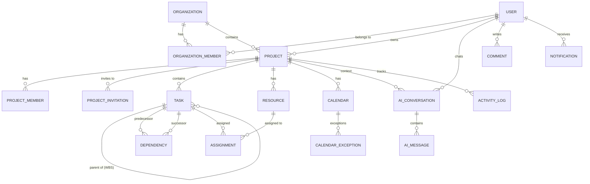

# Data Model

## Overview

Sophikon uses **28 PostgreSQL tables** with UUIDv7 primary keys, soft deletes, and JSONB for flexible configuration. The schema is inspired by Microsoft Project / ProjectLibre's data model, adapted for a multi-tenant web application.

## Entity Relationship Diagram

## Core Entities

### Tenant Layer

| Entity                | Purpose                                    | Key Columns                                      |
| --------------------- | ------------------------------------------ | ------------------------------------------------ |
| **User**              | Account + profile                          | email, password_hash, system_role_id, preferences |
| **Role**              | RBAC permissions (system + project scope)  | name, permissions (JSONB), scope                  |
| **Organization**      | Multi-tenant container                     | name, slug, is_personal, settings (JSONB)         |
| **OrganizationMember**| User ↔ Org membership                      | org_id, user_id, role (owner/admin/member)        |

**Intent:** Every user auto-gets a personal org on registration. Projects belong to orgs, creating data isolation. Org roles control who can create projects and manage members.

### Project Layer

| Entity                | Purpose                                    | Key Columns                                           |
| --------------------- | ------------------------------------------ | ----------------------------------------------------- |
| **Project**           | Scheduling container                       | org_id, owner_id, schedule_from, settings (JSONB)     |
| **ProjectMember**     | User ↔ Project with RBAC role              | project_id, user_id, role_id                          |
| **ProjectInvitation** | Email invite flow                          | project_id, email, token_hash, role_id, expires_at    |

**Intent:** Projects are scoped to organizations. Members get roles (owner, manager, member, viewer) that control endpoint-level permissions. Invitations use hashed tokens with 7-day expiry.

### Work Items

| Entity         | Purpose                                    | Key Columns                                                     |
| -------------- | ------------------------------------------ | --------------------------------------------------------------- |
| **Task**       | WBS work item (40+ columns)                | wbs_code, outline_level, order_index, duration, start/finish_date, constraint_type, is_summary, is_milestone, is_critical |
| **TaskBaseline** | Baseline snapshot for variance           | task_id, baseline_number (0-10), duration, start/finish, cost   |
| **Dependency** | Predecessor ↔ successor link               | predecessor_id, successor_id, type (FS/FF/SS/SF), lag           |

**Intent:** Tasks form a WBS hierarchy via `parent_task_id`. Summary tasks auto-aggregate children. The scheduling engine calculates dates, critical path, and slack. Dependencies support all four MS Project types plus lag/lead time.

**Task is the richest entity** with ~40 columns covering: scheduling (duration, work, dates), progress (percent_complete, actual_*), cost (fixed_cost, total_cost, earned value BCWS/BCWP/ACWP), and metadata (priority, constraints, external_id for imports).

### Resources & Assignments

| Entity                | Purpose                                    | Key Columns                                            |
| --------------------- | ------------------------------------------ | ------------------------------------------------------ |
| **Resource**          | Person, material, or cost resource         | type (WORK/MATERIAL/COST), max_units, standard_rate    |
| **ResourceRate**      | Cost rate tables (A–E) with effective dates| rate_table, effective_date, standard_rate               |
| **ResourceAvailability** | Availability periods                    | start_date, end_date, units                            |
| **Assignment**        | Resource ↔ Task link                       | units, work, work_contour, cost                        |
| **AssignmentBaseline**| Baseline snapshot of assignment            | assignment_id, baseline_number, work, cost             |

**Intent:** Mirrors MS Project's resource model. Work resources (people) have hourly rates and max allocation. Assignments track work distribution via work contours (flat, front-loaded, bell, etc.). Over-allocation is detected by comparing assigned units against max_units.

### Calendars

| Entity                | Purpose                                    | Key Columns                                     |
| --------------------- | ------------------------------------------ | ------------------------------------------------ |
| **Calendar**          | Working hours definition                   | work_week (JSONB, 7-day pattern), is_base        |
| **CalendarException** | Holidays, special working days             | start_date, end_date, is_working, work_times     |

**Intent:** Calendars define when work happens (Mon-Fri 9-5 with lunch break by default). Exceptions mark holidays or special days. Calendars can inherit from a base calendar. Tasks, resources, and projects can each reference a different calendar.

### AI

| Entity            | Purpose                                    | Key Columns                               |
| ----------------- | ------------------------------------------ | ------------------------------------------ |
| **AIConversation**| Chat session scoped to user + project      | user_id, project_id                        |
| **AIMessage**     | Individual chat message                    | conversation_id, role, content             |
| **AIUsage**       | Token/cost tracking per user               | user_id, tokens_used                       |

### Collaboration (Schema-only for some)

| Entity            | Purpose                                    | Status      |
| ----------------- | ------------------------------------------ | ----------- |
| **Comment**       | Polymorphic comments on any entity         | ✅ Active    |
| **Attachment**    | File uploads                               | ⚙️ Schema   |
| **Notification**  | In-app notifications                       | ✅ Active    |
| **ActivityLog**   | Audit trail per project                    | ✅ Active    |
| **TimeEntry**     | Time logging with approval workflow        | ⚙️ Schema   |

### Auth Support

| Entity              | Purpose                                  |
| ------------------- | ---------------------------------------- |
| **RefreshToken**    | JWT refresh token storage (revocable)    |
| **PasswordReset**   | One-time password reset tokens           |
| **EmailVerification** | Email confirmation tokens              |

## Design Principles

1. **UUIDv7 everywhere** — Time-ordered UUIDs for better B-tree index performance and globally unique IDs
2. **Soft deletes** — `is_deleted` + `deleted_at` on projects, tasks, orgs, comments (no data loss)
3. **JSONB flexibility** — Settings, preferences, work_week, permissions stored as JSONB for schema evolution
4. **Referential integrity** — CASCADE deletes on ownership FKs, SET NULL on optional references
5. **Index strategy** — Partial indexes with `WHERE NOT is_deleted` to avoid scanning soft-deleted rows

---

*Evidence: [`docs/02-design/database-schema.md`](../docs/02-design/database-schema.md), [`backend/app/models/`](../backend/app/models/), [`backend/app/models/enums.py`](../backend/app/models/enums.py)*
